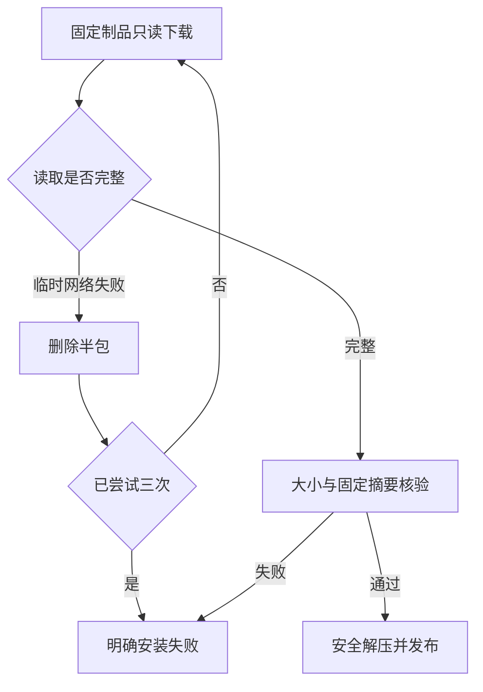

# ArtCraft 首次下载恢复方案

Node和领域技能归档是只读的固定制品下载。临时连接、TLS EOF、超时以及HTTP 408、429或5xx最多尝试三次，每次重置临时文件；间隔分别为1与2秒。网络重试不会执行领域编辑。403、证书校验失败、磁盘错误、大小或摘要不符仍失败。每次请求保留60秒连接超时；成功下载之后继续核验原有归档／逐文件／二进制摘要，不放宽锁。

此修复只属于独立Art技能源安装器，尚未自动改变四领域原生CLI各自的下载器。当前测试包括半包恢复、网络次数上限、HTTP拒绝／磁盘／大小错误与源技能回归。十技能公开冷安装、不可变源码发布及实际宿主安装副本还须逐一绑定证据，完成后才关闭OpenSpec4.8。
