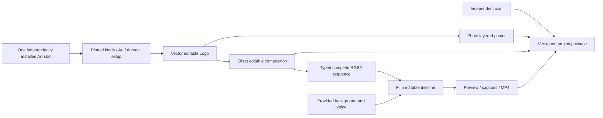

# ArtCraft dynamic sequence first use

## Versions and acceptance boundaries

Source dev.44 pins public immutable Art runtime dev.64, Film source dev.9 and Effect source dev.8. Photo source dev.9 and Vector source dev.10 remain fixed. The runtime is a separately published 30-file bundle; it is not a full plugin installation tag. Source copied-alone acceptance and fixed installed-plugin acceptance are separate gates. [OpenSpec contract](https://github.com/full-aigc-plugins/artcraft-plugin/blob/main/openspec/changes/establish-v1-plugin/specs/craft-artifact-protocol/spec.md) is the behavior authority for AC-AR-003.

## Execution and delivery

`examples/dynamic-brand-campaign.json` uses the public `workflow.py` entry point with existing `voice` WAV and `background` PNG assignments. It installs only the domains selected by the plan. Each independently installed Art skill includes this example and all setup/workflow/package resources; the loaded SKILL.md directory owns `SKILL_DIR`, with no `/mnt/skills` assumption or sibling dependency.

Effect exports `rgba-sequence/sequence.json` using MIME `application/vnd.craft.image-sequence+json` and descriptor schema `craft-image-sequence/v1`. Runtime inspection verifies every encoded frame and decoded RGBA pixel hash, Alpha extrema, normalized frame rate, count and reciprocal time base. Film receives the public `--sequence-asset` option rather than ordinary `--asset`. All frames are retained in artifact evidence and the collected Film project; the native project and per-frame exchange-loss records remain bound.

## Local revision and recovery

The example contains five nodes across four domains. A new revision changes only the source Logo color; poster, intro and film consume the changed asset version and rebuild, while the independent icon reuses its original task. Original input and delivery hashes remain unchanged. The green background, voice and initial Film frame remain unchanged; the animated Logo frame changes. The test checks actual Logo/poster pixels and independently decodes and samples the video composite.

For a damaged intermediate frame, the public workflow returns a nonzero exit and a JSON error containing the scheduler's blocked receipt. Restoring the original bytes and repeating the same frozen revision reuses the original task identities and budget. Packaging includes five children, native projects, all frames and version evidence; verification after relocation uses the externally retained package SHA.

## Evidence and remaining work

The source first-use test copies exactly one skill into `.agents/skills`, starts with an empty runtime, removes offline archive overrides and uses default public downloads. Its receipt binds copied skill files, distribution lock and actual domain versions. Fixed-plugin acceptance must repeat from a newly installed immutable Art plugin and check all 58 installed skill hashes; copied source evidence does not close that gate. Full V1, generic Skills CLI, model dispatch, GUI and creative approval remain open. Art does not adapt Jianying.

[Fixed dev.65 evidence](evidence/codex-release65-dynamic-first-use-20261006.json) binds installed dynamic four-domain Logo replacement/recovery and moved packaging, ordinary native source revisions, all 58 cold CLI starts and retained installation hashes. Default user-data storage now contains all four pinned native CLIs and Art runtime. Full V1 and creative gates remain open.
