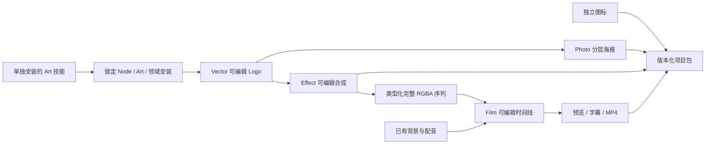

# ArtCraft 动态序列首次使用架构

## 版本与验收边界

技能源 dev.44 固定公开不可变 Art runtime dev.64、Film 技能源 dev.9 和 Effect 技能源 dev.8；Photo dev.9、Vector dev.10 保持固定。运行时为单独发布的 30 文件包，不是完整插件安装标签。源码单技能验收与固定安装插件验收分别记录。[OpenSpec 合同](https://github.com/full-aigc-plugins/artcraft-plugin/blob/main/openspec/changes/establish-v1-plugin/specs/craft-artifact-protocol/spec.md) 是 AC-AR-003 的行为事实源。

## 执行与交付

`examples/dynamic-brand-campaign.json` 通过公开 `workflow.py` 使用已有 `voice` WAV 与 `background` PNG，只安装任务图需要的领域。每项独立 Art 技能自带该示例及安装／工作流／打包资源；`SKILL_DIR` 来自实际加载的 SKILL.md 目录，不假定 `/mnt/skills` 或依赖兄弟技能。

Effect 导出 `rgba-sequence/sequence.json`，MIME 为 `application/vnd.craft.image-sequence+json`，描述 schema 为 `craft-image-sequence/v1`。运行时逐帧核对编码与 RGBA 像素摘要、Alpha 极值、规范化帧率、帧数及倒数时间基。Film 使用公开 `--sequence-asset`，不会将其当普通 `--asset`。全部帧进入公共证据与 Film 收集工程，原生工程及逐帧交换损失记录保持绑定。

## 局部返工与恢复

示例为四领域五节点。新 revision 只修改源 Logo 品牌色；海报、片头与成片因消费素材版本改变而重建，独立图标复用旧任务。原输入与旧交付摘要保留，绿色背景、配音与 Film 初始帧不变，动画 Logo 帧改变。测试检查真实 Logo／海报像素，并独立解码成片核对抽样合成。

中间帧损坏时，公开 workflow 非零退出，其 JSON error 包含调度器 blocked 回执。恢复原字节并重复冻结修订，复用原任务身份与预算。项目包包含五个子节点、原生工程、全部帧和版本证据；迁移后使用外部保存的包摘要核验。

## 证据与剩余工作

源码首次使用测试仅复制一个技能到 `.agents/skills`，从空运行时开始，清除离线包覆盖并使用默认公开下载；回执绑定技能文件、分发锁与实际领域版本。固定插件验收必须从新版不可变安装 Art 插件重复，并核对全部 58 个安装技能摘要；源码副本证据不能关闭此门禁。完整首版、通用 Skills CLI、模型派发、GUI、创作批准仍开放。Art 不适配剪映。
