# ArtCraft Effect expression distribution architecture

Pins Effect source19 with runtime83 and Film19/Photo18/Vector19 unchanged. All640 native commands retain verbatim parameters and recipe links. Each of ten independent skills owns the parenting/expression DAG, source revision plan and guide.

```mermaid
flowchart LR
    A[Independent Art entry and Brief] --> B[Install Node and runtime83]
    B --> C[Install only Effect19 and CLI]
    C --> D[Actual layer IDs and selection]
    D --> E[Null parent and property expression]
    E --> F[Native reopen and RGBA at two times]
    F --> G[Trusted source-bound revision]
    G --> H[Preserve parent control comp and original]
    H --> I[Verify moved package]
```

usageRecipes paths belong to the selected domain skillRoot. Art DAG examples are not raw command-component plans. Establish selection before parenting; preserve default transform compensation. Bind expression to transform/opacity and enabled. Samples0/0.5 seconds produce alpha128/191; source revision25+time*50 produces64/128. nativeProjectRef digest, externalInputs root and sourceProject bind the trusted source; plans cannot replace executors.

Public source-candidate cold creation, idempotence, source revision and moved packaging pass with parent/control/composition/IDs/original preserved. Regression120 total:90 pass,30 optional skips; five locked bundles rebuild. [Candidate evidence](evidence/art-effect-expression-candidate-20261007.json). New fixed installation and mixed retest remain pending. All expression-language features, exhaustive2639 commands, GUI/model and fullV1 remain open.
