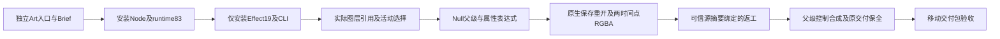

# ArtCraft Effect表达式分发架构

本增量锁定Effect源19，保留runtime83以及Film19／Photo18／Vector19；640项完整命令索引继承原生参数与场景引用。十项独立技能自身携带Effect父级／表达式DAG、源返工计划和指南，不依赖兄弟技能。

usageRecipes属于安装回执的领域skillRoot；Art自带DAG示例不能传给原始命令组件。明确选择后设置父级，保留默认变换补偿；表达式绑定transform/opacity与enabled。两个预览时间为0／0.5秒；Alpha128／191，源返工25+time*50后64／128。源工程通过nativeProjectRef摘要、externalInputs根和sourceProject资产绑定，不能由计划自由替换执行器。

候选公开冷安装、创建、幂等调用、原生返工及移动包通过；父级、控制、合成、ID与原交付保全。120项回归90通过／30明确可选跳过，五分发包按锁重建通过。[候选证据](evidence/art-effect-expression-candidate-20261007.json)。新固定安装与混合任务复验仍待完成；全量表达式语言、2639命令、GUI、模型与完整V1保持开放。
