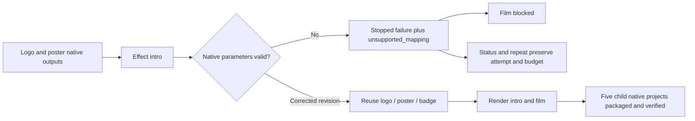
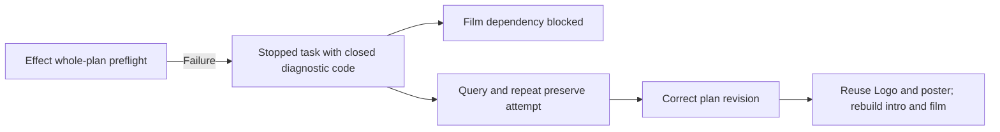

# ArtCraft effect parameter diagnosis architecture

## Authority and boundary

OpenSpec AC-TX-002-MAPPING owns this increment. EffectCraft source dev.7 / native CLI 0.2.0 rejects unknown fields as unsupported_mapping. ArtCraft runtime dev.48 had omitted that exact code from its closed whitelist: a single source skill cold-installed public bundles, its actual intro failed and Film was blocked, but persisted diagnosis contained a null domainCode. This is a diagnosis propagation repair, not a native engine edit.

## Bounded diagnostics and recovery

The collector still drains complete stdout/stderr and hashes every observed byte, while parsing at most 16 KiB. Only a closed JSON object containing exactly one string error field may report an exact whitelisted prefix. unsupported_mapping_suffix, extra fields, raw text, incomplete/oversized streams and conflicting codes do not become the domain code. Persisted diagnostics carry the code, stream, hashes and completeness; native field names/text are not retained as diagnostic prose. A child report does not replace token/epoch/group-stop evidence.

The five-node first-use scenario carries one copied execute skill and a generated voice asset. It intentionally supplies an unknown effect.apply field; actual native failure blocks Film, while the prior Logo/Photo/badge files remain intact. Status returns the same diagnosis, repeat retains task/attempt/budget, and a corrected revision reuses those three nodes, produces the intro and film, and verifies a five-child package. Skill and voice hashes remain unchanged. This tests technical recovery, not creative approval.

## Distribution and evidence

Runtime candidate dev.51 adds one closed error code and retains the existing protocol. The independent Art skill lock consumes complete immutable Effect source dev.7 Git ZIP; other domain packages stay pinned. Candidate verification uses explicit local bundled runtime/archive bytes and public native downloads, so it is separate from public release acceptance.

Target runtime tests fail twice before the repair and then pass 28/28. Current full runtime regression passes 141/147 with six explicit native optional skips; the source suite passes 66/85 with nineteen explicit live skips. Actual candidate mixed acceptance passes in 35.403 seconds. [Evidence](evidence/mapping-propagation-repair-20261006.json). Immutable runtime/skill/plugin publication and installed first-use remain pending at this milestone; task 5.16 stays open. ArtCraft does not install or adapt Jianying.

Release correction: candidate dev.51 passed the scoped test, but its publication tag points to old source and is invalid provenance. Do not install dev.51. Runtime dev.52 is the replacement candidate; immutable publication and installed acceptance remain pending.

## Fixed installed acceptance

Plugin dev.53 / skill source dev.38 / runtime dev.52 with Film dev.9, Effect dev.8, Photo dev.9 and Vector dev.10 installed in isolated Codex 0.153.4: all 58 skills discovered, zero loading errors. Installed execute copied alone passes the default-public native rejection and corrected five-child delivery (56.202s). Each of ten Art skills independently cold-installs dev.52 and checks CLI identity/help (110.577s); all 58 original installed skill hashes remain unchanged. All five distribution bundles reproduce exactly from immutable tags. [Version-bound evidence](evidence/codex-release53-effect-mapping-first-use-20261006.json). This closes only task 5.16; the generic Skills CLI, complete V1, model/GUI and creative gates remain open. Earlier pending statements describe the candidate/publication stages.

## Fixed Effect preflight upgrade

Runtime dev.66 prepares Effect source dev.9, preserving exact parameter_contract_identity_mismatch and parameter_schema_mismatch diagnostics alongside unsupported_mapping. Only bounded closed JSON reports are parsed; private command/field details are hashed and not persisted as prose. Failed children block consumers; corrected revisions reuse unaffected upstream outputs. [Runtime candidate evidence](evidence/effect-preflight-runtime-candidate-20261006.json): one red test, seven diagnosis tests pass; full runtime 165 passed / eight explicit skips. Fixed publication and installed mixed acceptance are separate.

[Source upgrade candidate / 源码升级候选](evidence/preflight-domain-upgrade-candidate-20261006.json): Art runtime dev.66 / source dev.45 / Effect source dev.9; source 75 passed / 25 gated skips; mixed mapping 1 passed (53.793s), dynamic brand 1 passed (61.581s), five locked bundles rebuilt. Immutable installed release acceptance remains pending.
