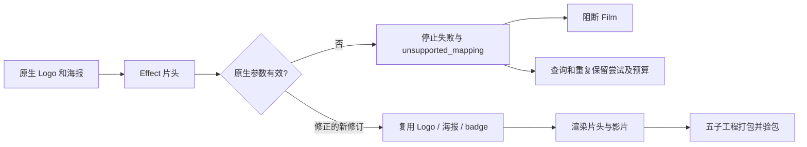
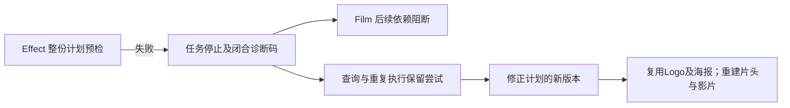

# ArtCraft 效果参数诊断架构

## 事实源与边界

OpenSpec AC-TX-002-MAPPING 管理本增量。EffectCraft 技能源 dev.7／原生 CLI 0.2.0 对未知字段返回 unsupported_mapping；ArtCraft runtime dev.48 的封闭白名单缺少该精确码。单独源码技能公开冷安装后，真实片头失败且 Film 阻断，但持久诊断 domainCode 为 null。本次修复诊断传播，不修改原生引擎。

## 有界诊断与恢复

采集器仍排空 stdout／stderr，并对全部已观察字节求摘要；解析缓冲最多 16 KiB。仅包含一个字符串 error 字段的闭合 JSON 可上报精确白名单前缀。相似后缀、额外字段、非结构化文本、不完整／超限管道及冲突错误都不能转成该领域码。持久记录只含错误码、管道、摘要与完整性，不保留原生字段／诊断正文；子任务报告不能替代 token／epoch 和进程组停止证据。

五节点首次使用任务只复制 execute 技能并提供生成的配音素材。故意添加非法 effect.apply 字段，真实原生失败后 Film 阻断，Logo／海报／badge 原文件保留。查询返回相同诊断，重复保持任务／尝试／预算；修正参数的新修订复用三个节点，生成片头与成片，并通过五子工程打包验包。技能及输入配音摘要保留。本用例验证技术恢复，不构成创作审批。

## 分发与证据

候选 runtime dev.51 仅增加一个封闭错误码，公共协议不变。独立 Art 技能分发锁使用固定 Effect dev.7 完整 Git ZIP；其他领域仍按原锁。候选阶段显式提供本地运行时／技能源包，原生依赖公开下载，不能替代公开新版或宿主安装验收。

修复前目标运行时测试两项失败，修复后 28 项通过；当前全量运行时 147 项中 141 通过、六项原生可选跳过；源码 85 项中 66 通过、十九项显式真实场景跳过。实际候选混合验收在 35.403 秒通过。[证据](evidence/mapping-propagation-repair-20261006.json)。本里程碑尚待不可变运行时／技能／插件发布及安装后验收，5.16 保持开放。ArtCraft 不安装或适配剪映。

发行纠正：dev.51 候选测试通过，但发布标签指向旧源码，来源无效，请勿安装。runtime dev.52 为替代候选；不可变发布及安装验收仍待完成。

## 固定安装验收

插件 dev.53／技能源 dev.38／runtime dev.52 与 Film dev.9、Effect dev.8、Photo dev.9、Vector dev.10 在 Codex 0.153.4 隔离安装：58 技能发现、零加载错误。安装后的 execute 单独复制，默认公开冷安装完成参数拒绝和修正后五子工程交付（56.202 秒）；十项 Art 技能分别从空运行时自动安装并核对 CLI 身份及帮助（110.577 秒），原安装 58 项技能摘要均保持不变。五个分发包从固定标签重建完全一致。[版本绑定证据](evidence/codex-release53-effect-mapping-first-use-20261006.json)。仅关闭 5.16；通用 Skills CLI、完整首版、模型／GUI 与创作门禁仍开放。前文待验状态保留候选及发布阶段的历史范围。

## 固定 Effect 预检升级

运行时 dev.66 准备绑定 Effect 技能源 dev.9，保留 parameter_contract_identity_mismatch 和 parameter_schema_mismatch 精确诊断及已有 unsupported_mapping。仍只解析有界闭合 JSON；私有命令／字段正文只计算摘要，不持久化为诊断文本。失败子任务阻断消费者，修正的新版本复用未受影响的上游产物。[运行时候选证据](evidence/effect-preflight-runtime-candidate-20261006.json)：一个预期失败测试，七项诊断测试通过；完整运行时165项通过／八项现场跳过。固定发行与安装后混合验收另行记录。

[Source upgrade candidate / 源码升级候选](evidence/preflight-domain-upgrade-candidate-20261006.json): Art runtime dev.66 / source dev.45 / Effect source dev.9; source 75 passed / 25 gated skips; mixed mapping 1 passed (53.793s), dynamic brand 1 passed (61.581s), five locked bundles rebuilt. Immutable installed release acceptance remains pending.
