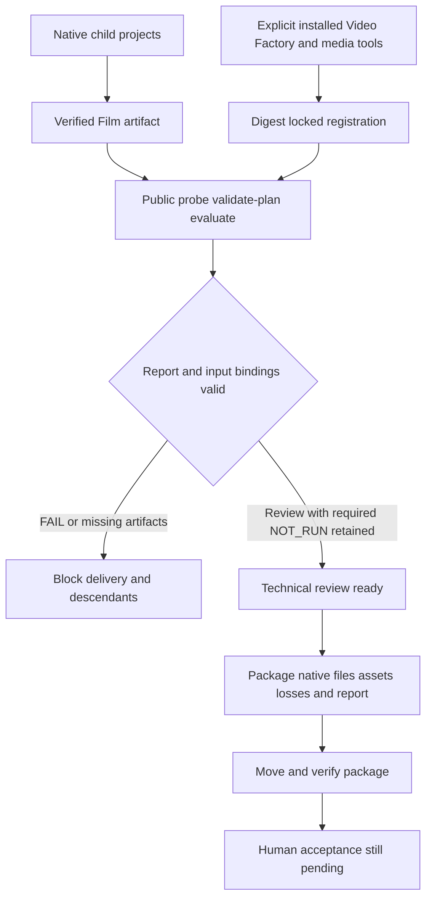

# ArtCraft External Delivery Acceptance Architecture

> Scope: AC-DM-006 public adaptation, delivery gates and version-bound evidence.
> Version: 1.0.0 · Updated: 2026-10-09

## 1. Decision and scope

All three specification scenarios pass on plugin dev.127/source dev.99/runtime dev.126-runtime.1; tasks 6.16/6.17/6.18 are complete. Existing production bytes are unchanged. The plugin establish-v1-plugin OpenSpec change remains authoritative; the skill repository mirrors evidence. This run used actual fixed host skills and an existing verified runtime cache, not a new cold installation. Earlier cold evidence remains separate.

## 2. Control and data flow

## 3. Scenario evidence

| Scenario | Verification |
|:---|:---|
| AC-DM-006-P | Six nodes: logo, subject, poster, intro, film and evaluation. The relocated package preserves native child projects, assets, losses and report. |
| AC-DM-006-N | A real child exits zero and returns accepted only: no artifacts, failed parent, blocked descendant, refused packaging and no repeat execution. This is a protocol unit fixture, not native creative acceptance. |
| AC-DM-006-VF | Public Video Factory 0.4.0 interface with locked Node/CLI/media tools and input hashes; provenance remains NOT_RUN and decision review. Wrong dimensions produce FAIL, block delivery and preserve original sources and the old moved package. |

[Version-bound evidence](evidence/external-delivery-fixed127-20261009.json) includes public tool locks, packaged file digests, call log hashes and scenario mapping. The pre-adapter historical commit lacks register-video-factory; the same current invocation registers successfully. This is a retrospective replay, not an original TDD log. The new boundary regression strengthens existing artifact checks without changing production behavior.

## 4. Failures and remaining gates

The parent publishes only verified artifacts. Art currently records generic artifact_invalid for failed verification; the separate report retains the dimensions FAIL. The domain detail is not attributed to the parent diagnostic collector. Repeat failures preserve task identity and budget. Technical review_ready is not human completion.

This covers macOS arm64, public validation and the named inputs, excluding Video Factory rendering, Jianying adaptation, general creative quality and other platforms. All 64 host skill trees match before and after execution. Eighteen numbered tasks plus historical SC-003 remain open (19 total); human acceptance, generic Skills CLI installation and full V1 remain open.

---
Document version: 1.0.0 · Created/updated: 2026-10-09 · Status: verified for the bounded gate above.
