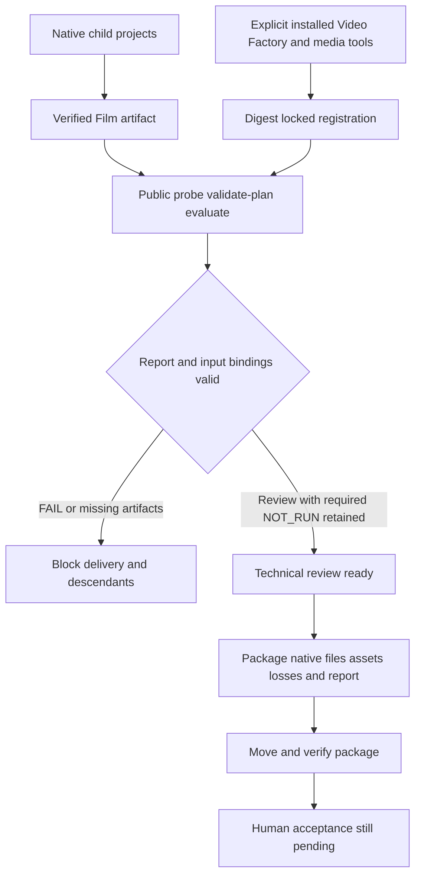

# ArtCraft 外部交付验收架构

> **文档说明**：记录 AC-DM-006 的公开适配、交付门禁和版本绑定证据。
> **版本**：V1.0.0
> **最后更新**：2026-10-09

## 1. 结论与边界

插件 dev.127／技能源 dev.99／runtime dev.126-runtime.1 的三个规范场景已验证，6.16／6.17／6.18 完成。复用已有实现，不改变生产字节。OpenSpec 的 establish-v1-plugin 仍是唯一规格事实源；技能仓镜像证据。本次运行使用真实固定宿主技能和已验证的运行时缓存，不能称为新增冷安装。此前冷安装记录独立保留。

## 2. 控制与数据流

## 3. 三个场景与证据

| 场景 | 验证 |
|:---|:---|
| AC-DM-006-P | Logo、主体、海报、片头、成片及验证报告六节点交付；包包含原生子工程、素材、损失与报告，并在移动后核验。 |
| AC-DM-006-N | 真实子进程退出零且仅返回 accepted，无法凭空产生输出；父流程失败、下游不执行、打包拒绝、重复请求不重跑。此为协议单元夹具，不是原生创作验收。 |
| AC-DM-006-VF | 使用 Video Factory 0.4.0 公开接口，固定 Node、CLI、媒体工具和输入摘要；provenance 为 NOT_RUN，decision 为 review；错误尺寸产生 FAIL、阻断交付，原工程及旧移动包保全。 |

[版本绑定证据](evidence/external-delivery-fixed127-20261009.json) 包含公开工具文件锁、包内文件摘要、调用日志摘要与场景映射。旧提交在适配器引入前缺少 register-video-factory，当前相同参数可登记；此为事后历史回放，不是原始 TDD 日志。运行时新边界测试补强已有产物校验，没有引入新行为。

## 4. 失败与剩余门禁

父任务只发布实际核验的产物。当前 Art 对验证失败保留通用 artifact_invalid；领域报告独立保留 dimensions 的实际 FAIL，不声称父错误已采集该详细原因。重复失败保持任务和预算。技术 review_ready 不等于人工完成。

本轮覆盖 macOS arm64、公开验证接口及给定样本；不覆盖 Video Factory 渲染、剪映适配、通用创作质量或其他平台。宿主 64 个技能树执行前后摘要一致。仍有 18 项编号任务及历史 SC-003（共 19 项）；人工接受、通用 Skills CLI 安装和完整 V1 继续开放。

---

**文档版本**：V1.0.0
**创建日期**：2026-10-09
**最后更新**：2026-10-09
**文档状态**：已验证上述有限验收范围
