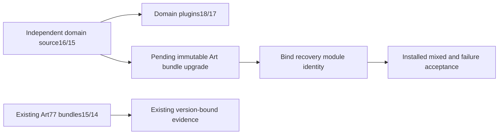

# ArtCraft Failed Stage Integration Architecture

> Runtime dev.78 published; candidate source dev.53 binds updated clients; fixed installed acceptance pending. Updated: 2026-10-07.

## Authority and current state

OpenSpec AC-RT-002 task4.9 owns the next incremental distribution upgrade. Domain standalone plugins Film18 and Effect/Photo/Vector17 fix original failed-stage preservation in source Film16 and other domains15. Art77 source52 still locks Film15 and other domains14. Installing newer independent plugins does not change Art77's downloaded source bundles.



## Required change and verification

Rebuild and publish new immutable Art runtime/source/plugin releases without changing old locks. The added preserved_stage.py module must participate in the trusted adapter files and capability snapshot/launcher identity. Test actual native save followed by an unknown public response through the public adapter/ledger: retain the product's original stage and dependency hashes, close the process, block consumers, retain attempt/budget, and prohibit replay. Proxy capture is not preservation evidence.

Verify ten independent Art skill cold installations, healthy four-domain mixed creation/revisions/recovery/moved package, exact fixed-tag host discovery and all58 installed hashes. Domain fixed evidence is a prerequisite and does not close Art task4.9. Full command, GUI, model and V1 acceptance remain separately open.


## Candidate identity binding

Runtime dev.78 requires all six adapter files, including `preserved_stage.py`. Missing recovery code fails configuration; altered content fails launcher identity. Source dev.53 pins Film16 and Effect/Photo/Vector15 immutable Git archives; each of its ten isolated skills carries the complete distribution lock. The capability snapshot and launcher both bind the recovery module SHA-256. Runtime dev.78 and all four source ZIPs reproduce from fixed tags.

```mermaid
sequenceDiagram
    participant Setup as Public skill setup
    participant Adapter as Trusted adapter
    participant Native as Native CLI
    participant Stage as Original staged project
    participant Ledger as Task ledger
    Setup->>Adapter: Six file hashes + capability snapshot
    Adapter->>Native: Authorized bounded plan
    Native->>Stage: Save native project
    Native--xAdapter: Unknown save response
    Adapter->>Stage: Preserve files + failure.json
    Adapter->>Ledger: Failed attempt; stop consumers; no replay
    Ledger-->>Setup: Read original attempt status
```

The post-save fault driver now reopens the product-retained original, verifies every retained file hash and byte count, checks the submitted last attempt and absence of a successful manifest, and tests no second prepare/save. The test proxy copy is only an independent checksum witness. The fixed installed gate remains open until the new plugin host, ten cold skills and native mixed/recovery cases pass.
