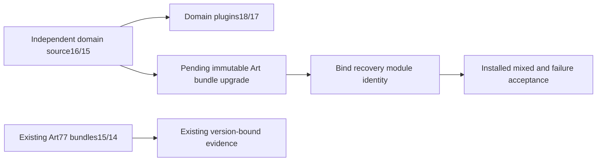

# ArtCraft Failed Stage Integration Architecture

> Integration design; fixed Art77/source52/runtime76 still uses older domain clients. Updated: 2026-10-07.

## Authority and current state

OpenSpec AC-RT-002 task4.9 owns the next incremental distribution upgrade. Domain standalone plugins Film18 and Effect/Photo/Vector17 fix original failed-stage preservation in source Film16 and other domains15. Art77 source52 still locks Film15 and other domains14. Installing newer independent plugins does not change Art77's downloaded source bundles.

## Required change and verification

Rebuild and publish new immutable Art runtime/source/plugin releases without changing old locks. The added preserved_stage.py module must participate in the trusted adapter files and capability snapshot/launcher identity. Test actual native save followed by an unknown public response through the public adapter/ledger: retain the product's original stage and dependency hashes, close the process, block consumers, retain attempt/budget, and prohibit replay. Proxy capture is not preservation evidence.

Verify ten independent Art skill cold installations, healthy four-domain mixed creation/revisions/recovery/moved package, exact fixed-tag host discovery and all58 installed hashes. Domain fixed evidence is a prerequisite and does not close Art task4.9. Full command, GUI, model and V1 acceptance remain separately open.
