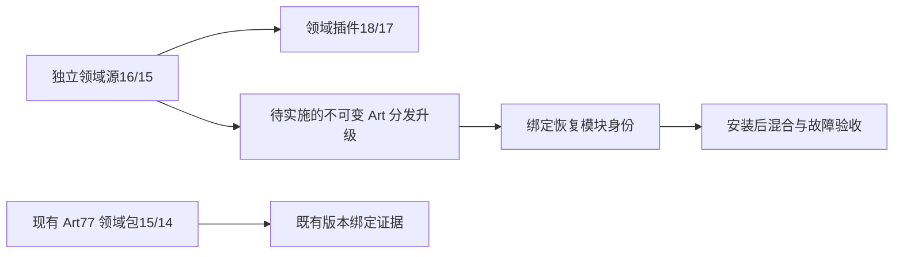

# ArtCraft 失败暂存集成架构

> 集成设计；固定 Art77／源52／runtime76 仍内置旧领域客户端。更新：2026-10-07。

## 事实源与当前状态

增量分发升级由 OpenSpec AC-RT-002 任务4.9持有。独立领域插件 Film18、Effect／Photo／Vector17，以 Film技能源16、其他领域15修复原暂存保留。Art77源52仍固定 Film15、其他领域14。安装新的独立领域插件不会改变 Art77 自行下载的技能源捆绑包。

## 必须实施与验收的内容

重建并发布新的不可变 Art 运行时／技能源／插件，保留旧锁。新增 preserved_stage.py 必须绑定受信适配器文件、能力快照及 launcher 身份。通过公开适配器与账本测试真实保存后响应未知：保留产品原暂存和依赖摘要、关闭进程、阻止消费者、保留 attempt／预算并禁止重放。测试代理捕获副本不能证明产品保全。

验证十个 Art 技能各自冷安装、四领域健康混合创作／返工／恢复／移动包、固定标签宿主发现及全部58项安装摘要。领域固定证据只是前置条件，不能关闭 Art4.9。全量命令、GUI、模型及完整 V1 验收仍独立开放。
