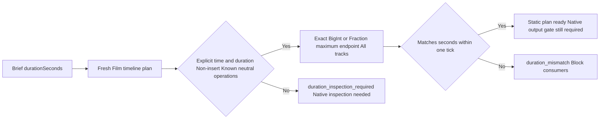
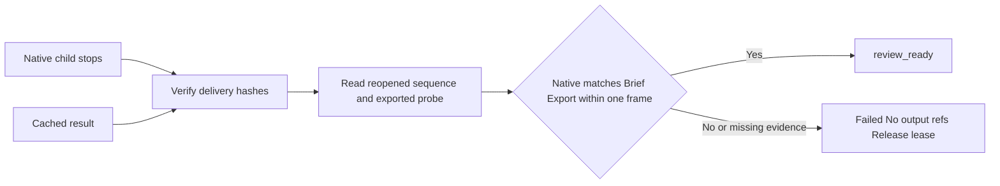

# ArtCraft Film Brief Duration Architecture

Status: local static-preflight and post-output candidate. AC-DM-001-TIME / task 6.26 is the authority; the task remains open until saved native-project/export constraints and fixed installed native first use are verified.

FilmCraft document creation accepts name, width, height and rational frameRate, not document.duration. A Brief durationSeconds requirement therefore cannot be checked against document.duration. Python and TypeScript now inspect fresh explicit timeline.place operations and compare the maximum time+duration across all tracks in FilmCraft ticks (254016000000 per second).

Ticks must be canonical unsigned decimal strings, at most signed 64-bit range after endpoint addition. Expected seconds are converted to a rational from their decimal number representation; at most one tick of representation error is tolerated, without float rounding of large timeline values. A zero timeline is never accepted. Video/audio overlap uses maximum endpoint, not summed track durations.

Only explicit insert=false placement and neutral supported asset/track/caption commands are statically known. Source-project revisions, implicit durations, insertion, trimming, moving, replacement, references in time fields, malformed or unknown commands remain blocked for native inspection. This is an honest partial preflight, not native project-duration or creative acceptance.

Evidence: evidence/film-brief-duration-preflight.json. Target Python/TypeScript tests and a copied single planning skill CLI cover ready/mismatch/uncertain cases, long audio and large ticks. Runtime dev.34 is now published; plugin dev.33/runtime dev.32 represent the preceding installed matrix. New source and plugin acceptance are tracked separately. The complete duration task remains open.

The post-output gate runs inside the adapter verification step, before the ledger can publish review_ready. It reopens hash-bound native.json and export-probe.json from the Film delivery manifest and verifies the native project and film.mp4 references. Native duration must match the Brief within one tick; exported duration may differ by one native frame for mux rounding. Missing, changed or inconsistent evidence fails the task and releases its lease. Cached and recovered ready results are checked again before reuse. These records are produced by the existing native workflow; fabricated unit fixtures prove rejection logic only.

Evidence for the candidate output gate is in evidence/film-brief-duration-output.json. Immutable release and fresh installed-runtime acceptance remain required before claiming first-use delivery.

Runtime dev.34 passed source-candidate dev.29 cold online first use: 3 tests, 93.401 seconds, with hash-bound one-second native Film and export evidence. Fixed source/plugin installation proof is still pending.

Fixed plugin dev.35 / skills dev.29 / runtime dev.34 now pass actual installed-skill cold online first use: 3 tests in 94.638 seconds. All 58 installed skills retain their hashes. The one-second saved Film timeline and actual exported probe are hash-bound. Source-project and unknown-edit native Brief inspection, generic installer and full creative acceptance remain open. See evidence/codex-release35-film-duration-native-20261006.json.
