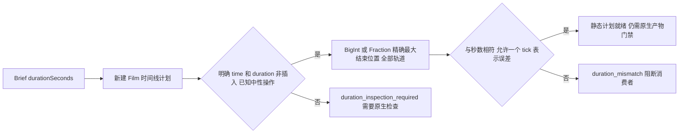
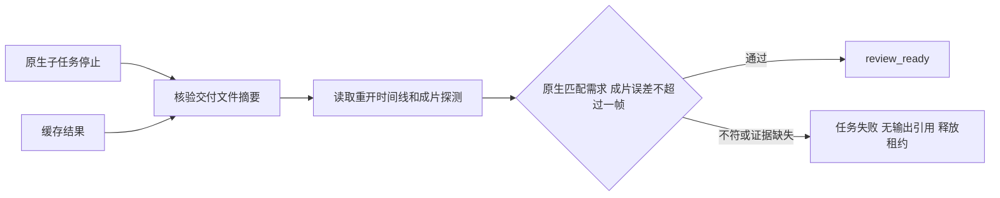

# ArtCraft Film Brief 时长架构

状态：本地静态预检候选。规格事实源为 AC-DM-001-TIME／任务 6.26；保存后原生工程／导出约束及固定安装首次使用验证完成前，任务保持未勾选。

FilmCraft 建档接受 name、width、height、frameRate，不接受 document.duration。因此 Brief 的 durationSeconds 不能与该字段比较。Python 与 TypeScript 现在检查新建明确的 timeline.place，并用 FilmCraft ticks（每秒 254016000000）计算全部轨道 time+duration 的最大结束位置。

ticks 为规范无符号十进制字符串，结束位置不超过有符号 64 位范围。需求秒数按十进制数表示转换为有理数，最多允许一个 tick 的数值表示误差，不把大时间线转换为浮点数比较。零时长不得通过；音画重叠取最大结束位置，不将轨道时长相加。

当前静态可知范围仅为明确 insert=false 的 placement，以及受支持的素材／轨道／字幕中性操作。源工程修订、隐式时长、插入、裁切、移动、替换、时间字段引用、无效或未知命令继续要求原生检查。这是部分预检，不是原生工程时长或创作验收。

证据：evidence/film-brief-duration-preflight.json。Python／TypeScript 目标测试及单独复制的规划技能 CLI 覆盖就绪／不符／不确定情况、超长音轨及大整数 ticks。已发布插件 dev.33／运行时 dev.32 在新固定发布前仍保持旧行为。完整时长任务保持开放。

保存后门禁在适配器 verify 内执行，先于账本发布 review_ready。依据 Film 交付清单的摘要，重新读取 native.json 中重开的 sequence 和 export-probe.json 中实际成片探测结果，同时绑定原生工程和 film.mp4。原生时长与 Brief 相差最多一个 tick；成片允许最多一个原生帧的封装舍入误差。证据缺失、变更或不一致时任务失败、不发布输出引用并释放租约。缓存和恢复的就绪结果在复用前再次检查。单元测试的人工文件仅证明门禁逻辑；实际原生执行另行验收。

候选输出门禁证据位于 evidence/film-brief-duration-output.json。固定发布与新安装运行时验收仍未完成，不能据此声称首次使用交付完成。

运行时 dev.34 与技能源候选 dev.29 已通过在线冷安装首次使用：3 项、93.401 秒，核验一秒原生 Film 工程和成片的摘要绑定证据。固定技能源／插件安装验收仍待完成。
