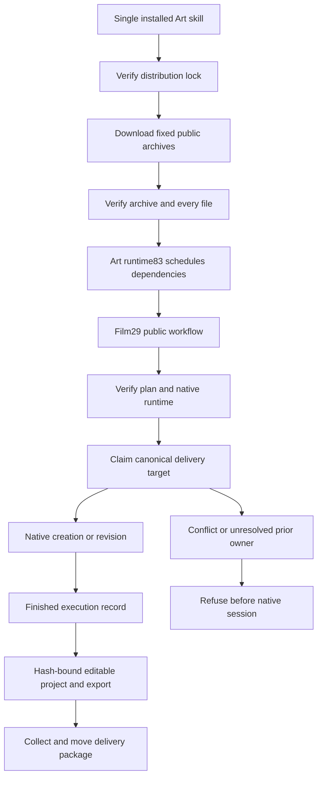

# ArtCraft Film Execution Protection Architecture

## Scope and status

SC-007 upgrades the Film skill bundle from dev.28 to dev.29 in all ten independently installable Art skills. The Art runtime remains dev.83, Effect and Photo remain dev.29, and Vector remains dev.28. The native Film executable is unchanged. Candidate validation and fixed publication acceptance are separate gates; complete V1 remains open.

## Components and first use

The distribution lock binds the public ZIP to its immutable source commit, archive SHA, size and complete per-file SHA inventory. The generated 2646-command index reads those immutable tags. Synchronization supplies the same lock and index to every role skill, without requiring sibling skills.

## Execution identity and retry

Art schedules each task into a separate delivery target. Film claims that canonical target after runtime verification and before native execution. A persistent record beside the delivery binds plan SHA, input SHAs, source project revision and native executable SHA. Success records `finished`. A competing live owner is refused; interrupted or uncertain records require reconciliation. Installer failures occur before the claim, so a failed download does not create an execution record.

Art same-revision reuse must preserve the finished record byte for byte. Source revision creates a distinct target whose record binds the original native project digest. Original outputs remain intact. The protection does not add automatic replay, global task deduplication or recovery of an unknown native child.

## Verification and acceptance

The distribution regression checks ten locks, thirteen Film guard scripts and thirteen usage guides, all bound to the fixed Film29 public archive. The cold mixed test copies one Art skill and uses default public downloads with system-only PATH. It verifies four editable native projects, actual Film duration, Film creation and revision records, no record mutation on reuse, old project preservation, receipt mismatch rejection and a moved package. Two archive-option tests prove that online acceptance cannot inherit offline overrides.

Source-candidate evidence is stored separately from the fixed Codex plugin installation evidence. Full command runtime coverage, generic Skills CLI installation, creative acceptance and complete V1 are not established by these checks. The guard's live-owner and interruption behavior has separate fixed Film31 acceptance; mixed tests establish its actual use and identity binding in Art.

Fixed Art99/source73 acceptance passed:64 installed CLI probes,10 independent empty Art runtime caches, one native mixed workflow and two archive-option contracts. All64 installed hashes remain unchanged. [Evidence](evidence/artcraft99-film29-fixed-first-use-20261007.json).
