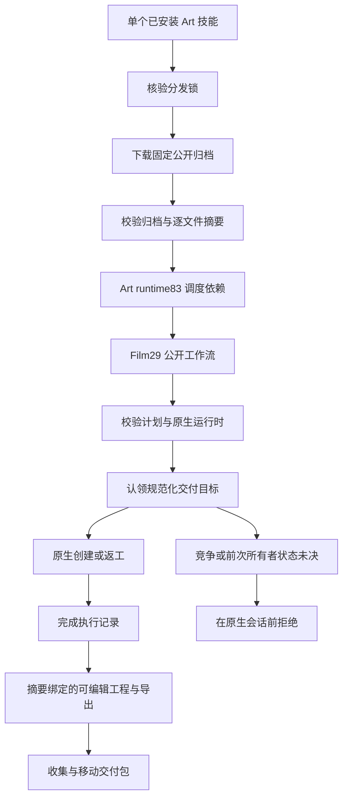

# ArtCraft Film 执行保护架构

## 范围与状态

SC-007 将十个可独立安装的 Art 技能中的 Film 技能包从 dev.28 更新为 dev.29。Art 编排运行时保留 dev.83，Effect 与 Photo 保留 dev.29，Vector 保留 dev.28，Film 原生二进制不变。源码候选验证与固定发行安装验收是两个门禁，完整 V1 保持开放。

## 组件与首次使用

分发锁将公开 ZIP 绑定到不可变源码提交、归档摘要、大小与完整逐文件摘要清单。2646 条命令索引从这些固定标签生成。同步工具为每个角色技能提供相同的锁和索引，首次使用不依赖兄弟技能。

## 执行身份与重试

Art 为每个任务使用独立交付目标。Film 在运行时校验后、原生执行前认领规范化目标。交付目录旁的持久化记录绑定计划摘要、输入摘要、原工程修订摘要和原生二进制摘要。成功后标记 `finished`；存在活跃竞争者时拒绝，中断或未知记录需要核对恢复。安装失败发生在认领之前，不生成执行记录。

Art 同修订复用必须保持完成记录字节不变。源工程返工使用新目标，其记录绑定原生工程摘要，原交付保持。该保护不提供自动重放、全局任务去重或未知原生子进程的自动恢复。

## 验证与验收

分发回归检查十份锁、十三个 Film 保护脚本与十三份使用指南，全部绑定固定 Film29 公开归档。冷混合测试只复制单个 Art 技能，使用默认公开下载与系统 PATH，验证四个可编辑原生工程、实际 Film 时长、创建及返工记录、复用不修改记录、旧工程保全、安装回执错误拒绝和移动交付包。另有两项归档参数测试，确保在线验收不继承离线覆盖。

源码候选与固定 Codex 插件安装分别记录证据。全量命令运行上下文、通用 Skills CLI 安装、创作接受和完整 V1 不由这些检查证明。竞争与中断行为由固定 Film31 独立验收提供；本次混合测试证明 Art 实际使用该保护并正确绑定身份。
