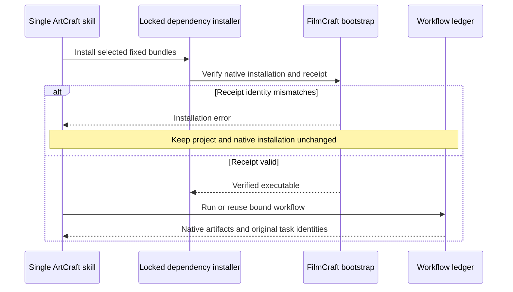

# ArtCraft FilmCraft Receipt Integration Architecture

ArtCraft source candidate dev.33 updates only the FilmCraft skill bundle from fixed dev.5 to dev.6 (85866c064c7d91abd8da63b0570d78bee3202bf5). Orchestration runtime remains dev.41; FilmCraft native CLI remains 0.2.0-craft.1. The other three fixed domain bundles are unchanged. Plugin candidate dev.43 receives skills only through the vendor tool.

## First use and reuse

The previous domain bundle ignored invalid receipt identity while reusing an intact executable. A real default-online test reproduced an incorrect review_ready result after the platform field changed. The new fixed bundle checks the receipt before ArtCraft dispatch. Rejected setup preserves every project file and native installation file. Restoring the original valid receipt permits same-revision reuse; no automatic repair or native replay is performed.

## Acceptance boundary

The integration test copies only one skill, downloads default public fixed dependencies into a fresh runtime with a system-only PATH, creates four native projects, repeats them, rejects the changed receipt, restores it and checks original task IDs. It also exercises four source-project Brief revisions, Photo variant cache checks and moved-package verification. Audio in this fixture is a sine tone; the test proves technical handoff, not spoken narration or creative acceptance. Source evidence and fixed-plugin host evidence must be recorded separately. Existing complete creative/model/GUI/other-platform release gates remain open.
