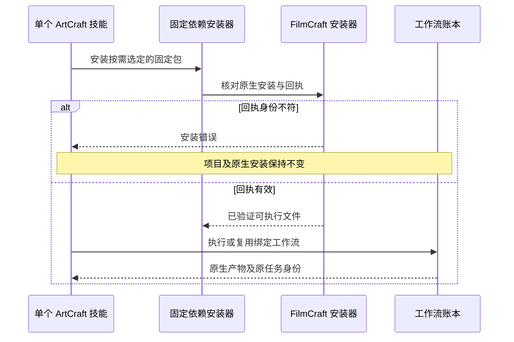

# ArtCraft FilmCraft 安装回执集成架构

ArtCraft 候选技能源 dev.33 仅将 FilmCraft 技能包从固定 dev.5 更新为 dev.6（85866c064c7d91abd8da63b0570d78bee3202bf5）。编排运行时仍为 dev.41，FilmCraft 原生 CLI 仍为 0.2.0-craft.1；其他三个领域固定包不变。候选插件 dev.43 仅通过 vendor 工具接收技能快照。

## 首次使用与复用

此前领域包在复用完整可执行文件时忽略回执身份异常；真实默认在线测试复现了平台字段被改后仍返回 review_ready。新固定包在 ArtCraft 派发前检查回执。安装拒绝后逐文件核对项目和原生安装保持不变；恢复原始有效回执后同修订复用原任务 ID，不自动修复或重放原生操作。

## 验收边界

集成测试仅复制一个技能，在全新运行时和仅系统 PATH 下从默认公开地址安装固定依赖，创建四种原生工程、重复调用、拒绝被改动的回执、恢复回执并核对原任务 ID。同时覆盖四种源工程 Brief 修订、Photo 变体缓存检查及移动交付包验证。该 fixture 的音频为正弦测试音，证明技术交接，不代表真实配音或创作接受。源码证据与固定插件宿主证据分别记录；完整创作、模型／GUI 及其他平台发布门禁保持未完成。
