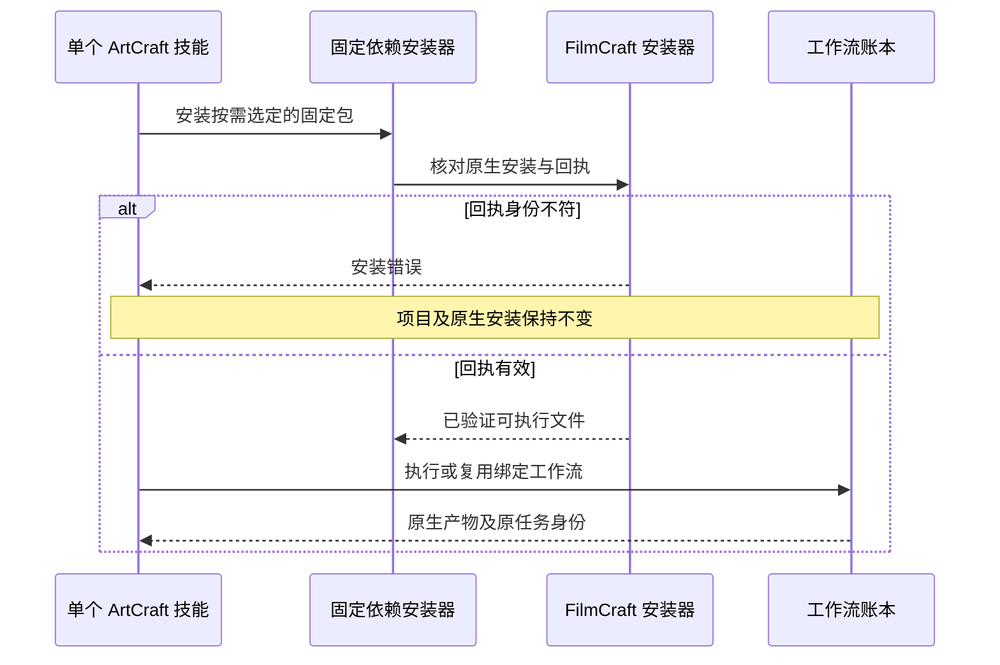

# ArtCraft FilmCraft 安装回执集成架构

ArtCraft 固定技能源 dev.33 仅将 FilmCraft 技能包从固定 dev.5 更新为 dev.6（85866c064c7d91abd8da63b0570d78bee3202bf5）。编排运行时仍为 dev.41，FilmCraft 原生 CLI 仍为 0.2.0-craft.1；其他三个领域固定包不变。固定插件 dev.43 仅通过 vendor 工具接收技能快照。

## 首次使用与复用

此前领域包在复用完整可执行文件时忽略回执身份异常；真实默认在线测试复现了平台字段被改后仍返回 review_ready。新固定包在 ArtCraft 派发前检查回执。安装拒绝后逐文件核对项目和原生安装保持不变；恢复原始有效回执后同修订复用原任务 ID，不自动修复或重放原生操作。

## 验收边界

集成测试仅复制一个技能，在全新运行时和仅系统 PATH 下从默认公开地址安装固定依赖，创建四种原生工程、重复调用、拒绝被改动的回执、恢复回执并核对原任务 ID。同时覆盖四种源工程 Brief 修订、Photo 变体缓存检查及移动交付包验证。该 fixture 的音频为正弦测试音，证明技术交接，不代表真实配音或创作接受。源码证据与固定插件宿主证据分别记录；完整创作、模型／GUI 及其他平台发布门禁保持未完成。

## 固定安装验收

Codex 0.153.4 安装五个固定公开发行版，发现全部 58 项启用技能，加载错误为零。实际安装的 ArtCraft dev.43／技能源 dev.33 冷启动混合测试 3 项通过（110.253 秒）。逐个单独复制 58 项技能，版本与命令发现全部通过（53.999 秒），每个领域使用一个全新运行时。独立中文真实配音 fixture 2 项通过（51.620 秒）：72 帧视频、字幕局部返工、非字幕区域 Logo 像素与音轨保留、其他任务 ID 不变及四子工程交付包验证。调用后 58 项安装技能摘要不变。QA 驱动摘要单独记录，不改写不可变技能源标签 dev.33。[有界证据](evidence/codex-release43-film-receipt-first-use-20261006.json)。完整创作、模型、GUI 和生产门禁继续开放。
