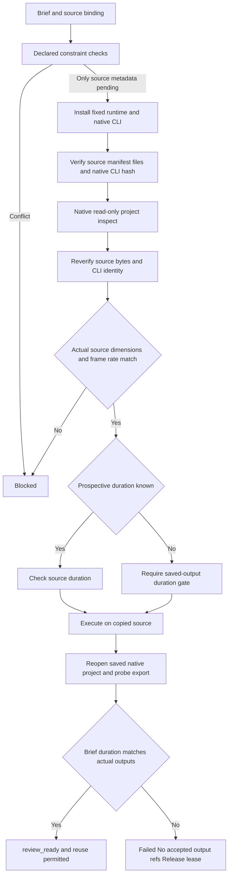

# ArtCraft Film Source Brief Architecture

Status: runtime dev.36 / independent source dev.30 / plugin dev.38 passed bounded technical first-use acceptance. Tasks 6.26, 6.27 and 6.28 are complete; full creative and overall acceptance remain open. Evidence: evidence/codex-release38-native-brief-first-use-20261006.json.

## Problem and execution contract

A source revision deliberately omits document creation. Declared Brief assessment therefore cannot obtain dimensions, frame rate or timeline duration from document. Supplying invented document fields would recreate the source and violate the source workflow contract.

Python and runtime preflight may defer only resolvable Film source metadata checks. Source asset identity and expectedRevision must be present. Ambiguity, authorization, budget, upload policy, format, brand and dependency conflicts remain blocking. Deferral means native inspection is required, not that the plan is ready or accepted.

## Trust and precision

The adapter runs the fixed nativeExecutable with --project and inspect, without a shell, with a 30-second timeout and 8 MiB response bound. It verifies the native binary digest against the task runtime identity and rechecks source manifest, native project and dependencies before and after inspection. SourceInspection is an internal adapter result; payload fields, user-provided technical metadata and cached declarations cannot supply it.

The JSON reviver reads duration from its original token through context.source. Signed 64-bit ticks stay decimal strings even above JavaScript safe integer precision. Width, height and rational frame rate have explicit bounds. The workflow record keeps craft-source-inspection/v1 summary, native response digest, source project digest and runtime digest, without raw native response text or private paths.

## Editing and acceptance

Subtitle and track-property edits use inspected source duration when their operations preserve timeline extent. Replacement, move and trim results may require native output verification. Those operations run only on copied source after actual dimensions and identity pass; the existing saved Film duration gate executes before review_ready, and rechecks cached results. Verified upstream outputs provide the dependency authority during execution.

Wrong dimensions block before the native write child starts. A source edit that successfully renders a longer video still fails ArtCraft artifact acceptance; the domain candidate may remain available for diagnostic review, but its output refs are not published as accepted outputs. Original source bundles remain unchanged.

## Evidence and open scope

Evidence: evidence/film-source-brief-native.json. Local tests cover source metadata, large ticks, malformed native responses, ambiguity and source-binding refusal; actual mixed workflow covers subtitle revision, shot replacement, reuse, source preservation, wrong dimensions and a successful native export rejected for Brief duration mismatch.

Fixed installed cold use and all four source Briefs now pass, including saved-output gates and three design geometry changes. Complete creative acceptance remains open. Procedural brand assets and tone audio are technical fixtures.
