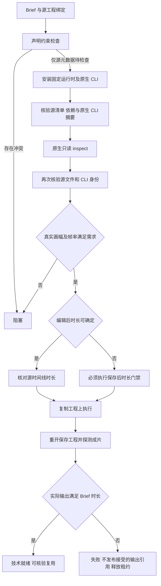

# ArtCraft Film 源工程 Brief 架构

状态：runtime dev.36／独立技能源 dev.30／插件 dev.38 已完成有界技术首次使用验收；任务 6.26、6.27、6.28 已完成，完整创作和整体验收仍开放。证据：evidence/codex-release38-native-brief-first-use-20261006.json。

## 问题与执行合同

源工程修订不能创建 document，因此不能从创建参数读取画幅、帧率和时间线时长。人为补 document 会违反源工程修订合同并可能重建工程。

Python 和运行时预检只允许有明确源素材身份与 expectedRevision 的 Film 元数据检查延后。歧义、授权、预算、上传政策、格式、品牌及依赖冲突仍阻止执行。延后代表必须读取原生工程，不能报告计划已通过或交付已接受。

## 信任与精度

适配器仅调用固定 nativeExecutable 的 --project 和 inspect，不使用 shell；超时为 30 秒，响应上限 8 MiB。原生二进制摘要必须匹配任务运行时身份，检查前后均核验源交付清单、原生工程及依赖。SourceInspection 仅来自可信适配器，任务 payload、用户填写的 technicalMetadata 或缓存声明不能提供它。

JSON reviver 使用 context.source 读取 duration 的原始整数 token。超过 JavaScript 安全整数的 signed 64-bit ticks 仍保留十进制字符串；画幅和有理帧率有明确范围。工作流记录保存 craft-source-inspection/v1 摘要、原生响应摘要、源工程摘要及运行时摘要，不保存原生响应全文或个人路径。

## 编辑与验收

保持边界的字幕和轨道属性修改使用真实源时长检查；镜头替换、移动与修剪无法预测时长时交给实际原生输出验收。真实画幅及身份检查通过后，这些操作只在复制工程上执行；现有 Film 保存后时长门禁先于 review_ready，并在复用时再次核验。执行中的依赖以已核验上游输出为依据。

画幅不符时，在原生写入子进程启动前阻塞。编辑即使原生导出成功，实际时长不符仍会被 ArtCraft 拒绝接受；领域候选目录可供诊断检查，但不会发布为已接受的输出引用。原始源交付目录保持不变。

## 证据与剩余范围

证据：evidence/film-source-brief-native.json。本地用例覆盖源元数据、大整数、非法原生响应、歧义和源身份拒绝；实际混合工作流覆盖字幕修订、镜头替换、复用、源文件保护、画幅不符，以及原生导出成功后因 Brief 时长不符被拒绝。

固定发布的安装后四源首次使用已完成，其他三个领域的源工程 Brief 和保存后门禁也已接通。完整创作验收仍开放；程序化品牌图形与音调音频仅用于技术验收。
