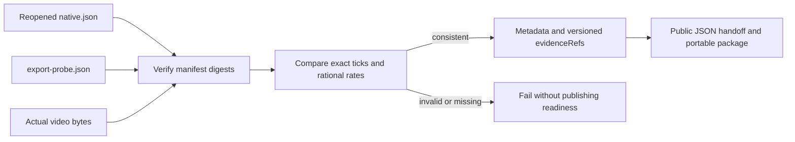

# ArtCraft Film timing metadata

The Film adapter previously verified native/export files but published an empty `technicalMetadata` object for video. That loses the public time base required by AC-CP-002-TIME. The runtime124 candidate maps digest-bound Film evidence into public metadata; complete protocol acceptance 2.3 remains open.

`src/adapters/film_export_metadata.ts` accepts canonical positive decimal tick strings bounded by Film signed int64, preserves every digit, supplies the fixed Film native time base `1/254016000000`, and carries rational frame rate, dimensions, alpha and available sample rate/channels. It checks native/export dimensions and rates, export name/actual byte size, and an exact rational one-frame mux tolerance with BigInt cross multiplication. No seconds-to-ticks inference or integer division truncation is used. Declared conflicting time bases, missing or numeric ticks, overflow and inconsistent probes are rejected.

The public adapter verifies every manifest file first, requires native/export probe entries for Film MP4 outputs, then binds both report files as versioned evidence references. Other domains keep their existing mapping. No native GUI, creative or color fidelity claim follows from metadata. Large-tick preservation has synthetic protocol evidence; it is not a long timeline render.

Two new contract tests reproduce the old missing metadata and accepted invalid probe behavior, then pass. Runtime regression: 294 total, 274 passed and 20 conditional skips. A real four-domain native mixed workflow passes with metadata assertions and saved-source revisions. Fixed source/plugin installation qualification is pending.

The single source96 candidate skill passes real public cold first use (25.825 seconds): Film creation/native reopen, timing metadata and evidence hashes, source caption style revision, original preservation, reuse and moved package. [Candidate evidence](evidence/film-time-metadata-candidate-20261008.json).
