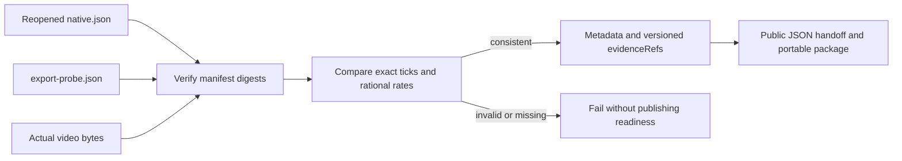

# ArtCraft Film timing metadata

The Film adapter previously verified native/export files but published an empty `technicalMetadata` object for video. That loses the public time base required by AC-CP-002-TIME. Fixed runtime124/source96/plugin124 maps digest-bound Film evidence into public metadata; complete protocol acceptance 2.3 remains open.

`src/adapters/film_export_metadata.ts` accepts canonical positive decimal tick strings bounded by Film signed int64, preserves every digit, supplies the fixed Film native time base `1/254016000000`, and carries rational frame rate, dimensions, alpha and available sample rate/channels. It checks native/export dimensions and rates, export name/actual byte size, and an exact rational one-frame mux tolerance with BigInt cross multiplication. No seconds-to-ticks inference or integer division truncation is used. Declared conflicting time bases, missing or numeric ticks, overflow and inconsistent probes are rejected.

The public adapter verifies every manifest file first, requires native/export probe entries for Film MP4 outputs, then binds both report files as versioned evidence references. Other domains keep their existing mapping. No native GUI, creative or color fidelity claim follows from metadata. Large-tick preservation has synthetic protocol evidence; it is not a long timeline render.

Two new contract tests reproduce the old missing metadata and accepted invalid probe behavior, then pass. Runtime regression: 294 total, 274 passed and 20 conditional skips. A real four-domain native mixed workflow passes with metadata assertions and saved-source revisions. Fixed installed acceptance is recorded below.

The single source96 candidate skill passes real public cold first use (25.825 seconds): Film creation/native reopen, timing metadata and evidence hashes, source caption style revision, original preservation, reuse and moved package. [Candidate evidence](evidence/film-time-metadata-candidate-20261008.json).

Fixed Art124/source96/runtime124 acceptance passes: 64 host discoveries and installed CLI probes, ten independently cold Art skills, installed Film timing first use and four-domain creation/revision/reuse/moved-package checks. All 64 installed trees remain unchanged. Three public archives byte-match; five fixed bundles rebuild exactly; eight fixed-commit CI runs pass. The 54 unchanged domain cold records are reused only after exact whole-tree identity equality.
[Fixed evidence](evidence/craft-art124-film-time-fixed-first-use-20261008.json).

Task 2.3 stays open: complete native large-tick handoff proof, applicable PNG/JPEG derived metadata and full protocol scenario acceptance are still incomplete. Generic Skills CLI installation 3.16 and GUI/creative/human/full V1 gates are not closed.

## Native large-integer supplement (2026-10-08)

The former dev.124 fixture-only boundary now has [native save and handoff evidence](evidence/native-film-big-time-20261008.json). Fixed Film `0.2.0-craft.4` creates a project at `9007199254740993` ticks with a one-frame duration of `21168000000` ticks. Saving and reopening preserves the end at `9007220422740993`. Ordinary JSON Number parsing rounds this value; Art's raw-token parser preserves its decimal string.

A one-frame trim on a copy changes the end to `9007241590740993` without changing the original project digest. Trusted `publicSkillFactory.inspectSource` reads the real project after checking executable, project and manifest digests. JSON roundtrip and BigInt reconstruction preserve the two-frame interval; source drift is refused. A separate globally aligned project verifies an integer frame index. Fixed installed Film skill files and executable remain unchanged. All 26 timing-related tests pass, including existing overflow, absent time base and inconsistent probe rejection.

The acceptance driver constructs the manifest wrapper. This is not a public domain workflow long-timeline render or a full-length video export. Production runtime and all ten source skills are unchanged, retaining Art125/source97/runtime125; this is test and documentation maintenance. Fixed125 evidence separately closes derived PNG/JPEG metadata. Task 2.3 remains open for the complete protocol scenario matrix and unverified end-to-end boundaries. Native inspection cannot substitute for those gates.
