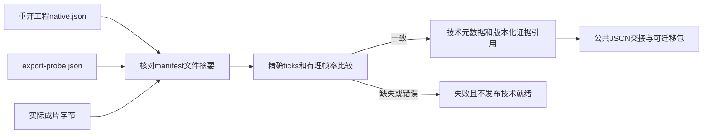

# ArtCraft Film 精确时间元数据架构

原 Film 适配器核验了原生工程与导出文件，但影片的公共 `technicalMetadata` 为空，交接时丢失 AC-CP-002-TIME 要求的时间基准。固定runtime124／源96／插件124补齐摘要绑定的原生／探测记录映射；完整协议验收2.3继续开放。

`src/adapters/film_export_metadata.ts` 只接受规范正十进制ticks字符串且不超Film有符号int64，逐位保留，补充固定Film原生时间基准`1/254016000000`，交接有理帧率、尺寸、alpha及可用的采样率／声道。核对原生与导出尺寸和帧率、探测文件名与实际字节数，并使用BigInt交叉乘精确比较一帧封装容差；不经浮点秒推导ticks，也不整除截断时间。时间基准冲突、ticks缺失／数值型／溢出或探测不一致均拒绝。

公开适配器先核验manifest中全部文件，要求Film MP4具有原生／探测记录，再将两份报告绑定为版本化证据引用。其他领域沿用既有映射；元数据不证明GUI、创作或色彩保真。大整数ticks使用协议夹具验证，不声称渲染长时间线。

新增两项合同测试先复现旧实现遗漏元数据和接受错误探测，再全部通过。运行时294项中274通过、20条件跳过；真实四领域原生混合、元数据断言与源工程返工通过。固定安装验收见下方证据。

独立源96候选的真实公开冷启动通过（25.825秒）：Film创建、原生重开、元数据和证据摘要、源工程字幕样式修改、原文件保全、任务复用及移动包通过。[候选证据](evidence/film-time-metadata-candidate-20261008.json)。

固定Art124／源96／runtime124的公开安装通过：64项宿主技能发现与安装CLI核验、十项Art独立空缓存冷启动、安装后的Film专项和四领域创建／返工／复用／移动包通过，64安装技能摘要保持。三个公开发行包逐字节匹配，五个锁定包重建匹配，两个固定提交的八项CI通过。54项未变领域技能冷启动记录仅在整树摘要相同后复用。
[固定证据](evidence/craft-art124-film-time-fixed-first-use-20261008.json).

2.3保持开放：大整数ticks仍需完整原生时间交接证明，适用的PNG／JPEG派生物技术元数据尚需补齐，且完整协议逐场景矩阵未验收。3.16通用Skills CLI安装与GUI／创作／人工／完整V1门禁不由此关闭。
