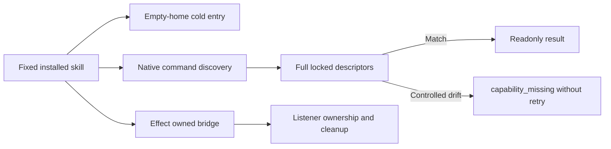

# ArtCraft fixed command distribution checkpoint

Plugin135/source107/runtime134-runtime.1 passes ten independent cold first uses (161.691 seconds, Python3.13.5, system-only PATH). Every skill begins with an empty runtime home and completes pinned runtime/version/help checks. The temporary install is removed before the next skill; this does not prove generic Skills CLI installation or creative acceptance.

Forty real headless native probes cover four domains and2646 command descriptors: normal/context-only responses pass; missing/changed/presence/duplicate/malformed/invalid JSON/query failure/caught refusal cases stop. Mutations occur after a genuine readonly native reply, not in a fake native server; no editing request is sent. The installed standalone guard is byte-identical to the fixed core embedded guard.

The fixed plugin's210 controlled mode/bridge identity targets pass. An actual fixed signed Effect desktop bridge passes discovery/ui_inspect/ui_elements; its listener belongs to the launched process and both owned processes stop. The actual GUI save/stale plan gate is separately complete in task5.3. Four-domain native source revision and serialization acceptance is also separate.

Thirty-six real post-save reply faults pass against the extracted, hash-verified published runtime134 core and existing native dependencies. The fixture keeps runtime132 metadata from its original installation receipt; the explicit core override and release file digests identify the executed Art core. This is not a fresh full mixed cold installation.

[Fixed checkpoint evidence](evidence/command-fixed135-checkpoint-20261009.json). Task4.6 remains open: other applicable domains' actual bridge/desktop qualification and the full current upgrade scenario applicability audit are still required. Historical evidence is retained with original versions; candidate, controlled, real native, installed, cold and GUI scopes stay distinct. Eleven numbered tasks and complete V1 remain open.
