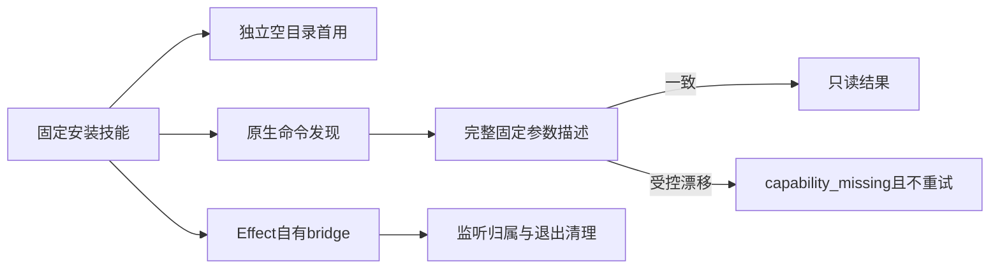

# ArtCraft 固定命令分发检查点

插件135／源107／runtime134-runtime.1的十个独立技能空缓存首用通过（161.691秒，Python3.13.5，仅系统PATH）。每项技能从空运行时目录开始，完成固定运行时、版本与帮助检查，之后删除临时安装再测试下一项；不证明通用Skills CLI安装或创作验收。

四领域40项真实headless原生探测核对2646项命令参数描述：正常及上下文字段变化通过，缺失／描述漂移／存在性变化／重复／畸形／非法JSON／查询异常／捕获拒绝后重试均停止。受控修改发生在真实只读原生响应之后，没有使用假原生服务，也没有发送编辑请求。固定安装的独立guard与固定核心内嵌guard字节一致。

固定插件内的210项模式／bridge身份受控测试通过。真实固定签名Effect桌面bridge通过发现、ui_inspect、ui_elements，确认监听属于启动进程，两个自有进程均停止。真实GUI保存／旧计划冲突门禁另由任务5.3完成；四领域源修订与串行验收也独立记录。

36项真实保存后响应故障在已提取、逐文件摘要核对的公开runtime134核心及既有原生依赖上通过。夹具保留原安装回执的runtime132元数据，实际Art核心由显式覆盖目录及发行文件摘要确认；不把它称作全新混合空缓存安装。

[固定检查点证据](evidence/command-fixed135-checkpoint-20261009.json)。任务4.6继续开放：其他适用领域真实bridge／desktop资格，以及完整升级场景的当前适用性审计仍需完成。历史证据保留原版本，候选、受控、真实原生、固定安装、空缓存、GUI证据不混用。仍有11项编号任务和完整V1开放。
