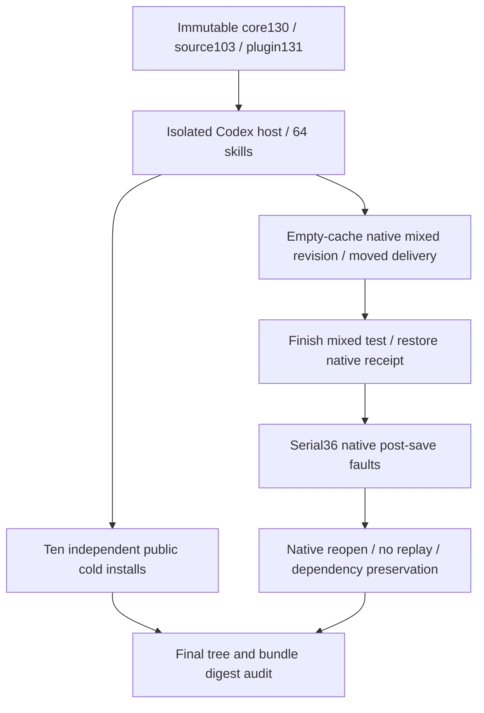

# ArtCraft Fixed Inner JSON Distribution Architecture

Plugin131/source103/runtime130 now carries the Art-owned strict response boundary in immutable public prereleases. The35-file core ZIP includes strict_mcp_runner.ts. Canonical rebuilding reproduces all five locked bundles; current public asset digests match local runtime, source and plugin ZIP bytes. Domain versions and full source archives remain unchanged. Historical Art81 reused runtime78 for a child-only upgrade; this repair intentionally requires a new parent core, while old129/102/130 assets and failing evidence remain intact.

Actual isolated Codex0.147.0 installation discovers five plugins/64 skills with zero loading errors. All64 installed tree digests are reverified after use. Ten Art skills independently cold-download Node and the new core from public URLs, each with system-only PATH and an empty separate runtime;20 version/help probes plus10 actual missing-ledger upgrade refusals pass in189.916seconds. Temporary cold caches are removed by the existing verifier after each case; their proof is retained.

A copied fixed installed Art use skill with an empty runtime passes3 native mixed tests in185.994seconds:22 public calls, four native source inspections/revisions and reuse, frozen identity refusal, Film metadata/receipt protection, four-child moved package, Photo variant tamper refusal/restoration and no replay. Four native domains then pass36 post-save response faults in16.221seconds, including nonfinite/overflow/duplicate inner JSON. They load the actual installed core without a working-tree override. Original product-retained native stages reopen, registered Film input bytes survive, consumers remain blocked, same attempt/budget is preserved and each case saves only once after repetition.

The first fault matrix overlapped the mixed test, which deliberately changed Film installation.json platform to wrong-platform. Three Film cases refused with installation_receipt_mismatch;33 passed. The mixed test restored the original receipt. After its process completed, a fresh retained fault root passed36/36. Original failure logs/stages remain; this environment conflict is not a product-red claim. Earlier source-guide and plugin version-reference validation failures are also retained with corrected passes.

[Fixed evidence](evidence/fixed-inner-json-distribution131-20261009.json) binds raw host/cold/mixed/fault proofs, logs, all64 tree hashes and complete bundle file counts. Compared with core129,32 files are byte-identical; package.json and public_skill.ts changed, and strict_mcp_runner.ts is new. Six installer/precheck/index resources per Art skill remain byte-identical; all domain bundles remain identical. The[131 scenario audit](evidence/runtime-upgrade-scenario-audit131-20261009.json) therefore distinguishes two current fixed-installed scenarios (failed-stage and inner JSON) from seven retained scenarios whose relevant code paths remain unchanged. The130 audit retains its own historical failure status.

Task4.16 is complete for this bounded repair/distribution gate. Task4.6 remains open:9/14 scenarios have evidence (2 freshly installed,7 explicitly justified reuse), with12 numbered tasks still open. Generic capability, brand/gateway/segmented reconciliation, generic Skills CLI, GUI/model/human creative and other-platform gates remain. No OpenSpec archive or marketplace promotion occurs.
