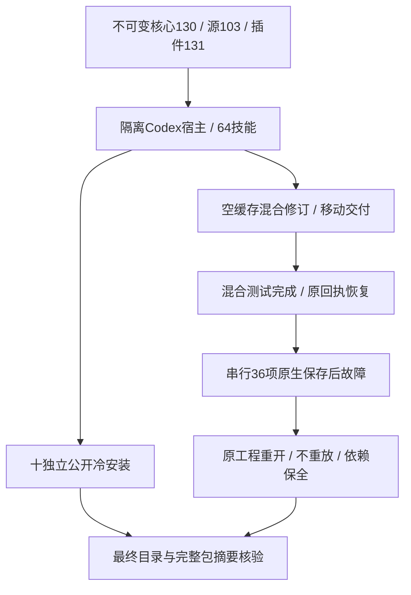

# ArtCraft 固定内层 JSON 分发架构

plugin131/source103/runtime130已通过不可变公开开发预发布交付Art自有严格响应边界。35文件核心ZIP包含strict_mcp_runner.ts，五个固定包确定性重建通过，公开运行时／技能源／插件资产摘要与本地ZIP一致。四领域版本和完整源归档不变。历史Art81仅更新子包时复用runtime78；本次父边界修复明确使用新核心，旧129／102／130资产及失败证据保留。

实际隔离Codex0.147.0安装发现5插件／64技能，加载错误为零，使用后64项目录摘要复核一致。十个Art技能分别以系统PATH、独立空运行时，从公开地址冷下载Node和新核心；20次版本／帮助与10次真实缺失账本升级拒绝通过，耗时189.916秒。既有验证器在每项后删除其临时冷缓存，证明收据保留。

复制当前固定安装use技能，从空缓存执行真实混合验收，3项185.994秒通过：22次公开调用、四领域原生源检查／修订／复用、冻结身份拒绝、Film元数据／回执保护、四子工程移动包、Photo变体篡改拒绝与恢复不重放。随后四领域36项保存后响应故障16.221秒通过，包括内层非有限／溢出／重复键。测试加载实际安装核心，无工作树覆盖；原始产品暂存工程重开、Film登记输入保全，下游阻断、原attempt／预算保留，每例重复后仍只保存一次。

首次故障矩阵与混合用例重叠，后者有意将Film installation.json平台改为wrong-platform；三个Film用例返回installation_receipt_mismatch，另33项通过。混合用例恢复原回执。等待该进程完成后，以新保留目录串行复验36/36通过。首次日志及暂存均保留，该环境冲突不宣称产品红灯。技能源指南及插件版本引用检查的首次失败与修正后通过也分别保留。

[固定证据](evidence/fixed-inner-json-distribution131-20261009.json)绑定宿主／冷安装／混合／故障原始收据、日志、64目录摘要与完整包核验数量。相较core129，32项文件字节不变；package.json与public_skill.ts改变，新增strict_mcp_runner.ts。每个Art技能六项安装／预检／索引资源字节不变，领域包完全一致。[131场景审计](evidence/runtime-upgrade-scenario-audit131-20261009.json)据此区分两项当前固定安装场景（失败暂存和内层JSON），以及七项相关代码路径未变且明确说明复用依据的既有证据；130审计仍保留原失败状态。

本修复及分发有界门禁4.16完成。4.6整体继续开放：14场景中9项有证据（2项新固定安装、7项明确依据复用），12个编号任务仍开放。通用能力、品牌／网关／分段证据收敛、实际Skills CLI、GUI／模型／人工创作及其他平台门禁仍需推进。不归档OpenSpec，不加入可安装市场。
