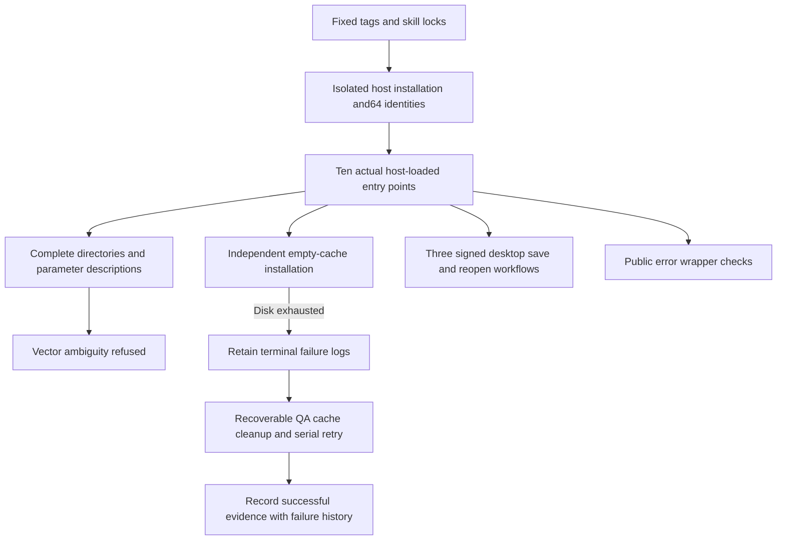

# ArtCraft fixed136 mode and error acceptance

Audience: owners of tasks1.3,4.6 and4.19. Scope: macOS arm64, development plugin136 / independent source108 / runtime135-runtime.1. Status: partial acceptance; twelve numbered tasks remain open. This record follows the existing delivery architecture and full-stack-doc evidence rules without changing requirements.

## 1. Immutable identities and entry points

An actual isolated Codex installation discovers64 skills across five fixed plugins with zero loading errors. Film41 / Effect38 / Photo38 / Vector37 remain pinned. Art136 vendors source108. Tests use the ten host-discovered Art directories and verify whole skill-tree hashes before and after use. Domain sources and published tags are preserved.

## 2. Observed coverage

| Check | Result | Evidence boundary |
| :--- | :--- | :--- |
| Actual isolated host | 5plugins,64skills,zero loading errors | Immutable installation and discovery; excludes model dispatch |
| Independent cold starts | Ten separate Node/core installations, version/help queries and missing-ledger upgrade refusals | One empty runtime per entry; temporary copy removed before the next |
| Catalogs and parameters | 80 complete directory queries and20 Film parameter descriptions | All ten entries expose2646 headless commands and2817 desktop records, retaining Vector duplicates |
| Signed native desktop | Film5,Photo5,Effect6 steps save and reopen | Owned listeners, stopped processes and native identity; excludes execution of every command |
| Actual bridge | Three domains pass | Installed Art entry connects to a test-owned session,saves/reopens; owned listener and stopped processes verified |
| Explicit-mode checks | Three valid plans and one Vector ambiguity refusal | Explicit QA runtime; structure checking is separate from native execution |
| Public errors | 44 fixed-runtime tests,120 installed wrapper cases and4 actual native post-save faults | Error identities,budget alias,ledger preservation and no replay; full consumer compatibility remains open |

Desktop counts are Film666 / Effect640 / Photo748 / Vector763 records, with762 distinct Vector IDs. Conflicting engine/UI file.place descriptors remain refused. The existing specification rejects duplicate IDs; the proposed namespace exception is awaiting approval and is not implemented.

All35 runtime source/schema files match the release archive. The44 controlled tests import that extracted core directly. Four native faults explicitly select the same core; retained domain installation metadata naming runtime132 remains historical metadata, not the executed core identity. Installed wrapper tests load the ten actual workflow modules and use controlled upstream error inputs.

## 3. Environmental failures and recovery

Two cold attempts terminated on disk exhaustion without success receipts. The first Effect desktop attempt also failed to create a temporary directory; its separate retry passed. One QA structure-check batch omitted the isolated runtime argument, started default-home domain setup and reached disk exhaustion. It is excluded from isolated acceptance; the explicit-home retry separately records three passes and one refusal. Existing default-home contents were preserved.

Cleanup removed only recoverable Git metadata in this QA installation and duplicate uploaded ZIPs. Installed skills, original repositories and tags remain intact. Installed documentation was temporarily compressed for the cold run, then restored and checked against every saved hash. All64 skill identities were verified again. Failure and success logs remain separate.

## 4. Remaining gates

Task1.3 needs the complete public response/consumer compatibility matrix. Task4.19 needs Vector ambiguity resolution and its mode qualification; Film,Photo and Effect actual bridge workflows now pass; three representative desktop workflows do not prove execution of all commands. Task4.6 needs the full current-version upgrade applicability audit. Generic Skills CLI installation is awaiting the existing installation authorization answer;3.6/3.16 remain open. Formal host/platform/permission/secret gates retain their prerequisites. OpenSpec is not archived and V1 is not complete.

[Machine evidence](evidence/fixed-mode-error136-20261009.json) records identities,hashes,log fingerprints,environmental failures and exclusions. Plugin host-acceptance-art136.lock.json is the host matrix; the skills repository shares this record without creating another specification authority.
