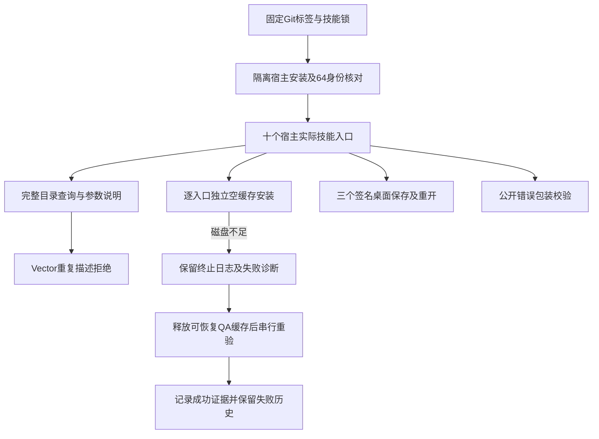

# ArtCraft 固定136模式与错误验收

本记录面向任务1.3、4.6、4.19的实施与验收负责人，限定于 macOS arm64 的开发版插件136／独立技能源108／运行时135-runtime.1。状态：部分验收；12项编号任务保持开放。沿用既有交付架构与 full-stack-doc 的证据规则，不改变产品边界或验收要求。

## 1. 固定身份与使用路径

实际隔离 Codex 安装五个固定插件并发现64项技能，加载错误为零。四领域继续使用 Film41／Effect38／Photo38／Vector37；Art136固定源108。十个 Art 入口均从宿主发现的技能目录执行，使用前后核对技能整树摘要，不修改领域源码或现有发行标签。

## 2. 实际覆盖

| 检查 | 结果 | 可证明的范围 |
| :--- | :--- | :--- |
| 隔离宿主安装／发现 | 5插件、64技能、零加载错误 | 固定标签的宿主发现与内容身份；不含模型调度 |
| 独立空缓存 | 十入口分别安装Node与固定核心，查询版本／帮助并拒绝不存在账本的升级 | 每次使用独立运行时，结束后删除本项临时副本 |
| 模式目录／参数 | 80次完整目录查询、20次Film参数描述 | 十入口均可查询headless2646条、桌面2817记录；包含Vector重复原始记录 |
| 实际签名桌面 | Film5步、Photo5步、Effect6步保存／重开通过 | 监听归属、本次进程停止和原生二进制身份；非所有命令运行资格 |
| 实际bridge | 三领域通过 | 从已安装Art入口连接本次持有会话，保存／重开；逐次监听归属及进程停止通过 |
| 显式模式预检 | 三领域通过、Vector歧义拒绝 | 使用明确QA运行时；结构检查不等于原生执行 |
| 公共错误 | 44项固定归档运行时测试、120个已安装包装用例、4个真实原生保存后故障 | 错误身份、旧预算别名、账本保全与不重放；完整消费者兼容仍待验收 |

桌面目录记录数为 Film666／Effect640／Photo748／Vector763（Vector仅762个不同ID）。`file.place` 的引擎与UI参数描述冲突保持拒绝，没有选择一条覆盖另一条。现有规范禁止重复ID；命名空间例外尚未获批准，本记录不改变此要求。

35个运行时源码／schema文件从发布归档逐项核验。44项受控错误测试直接导入解包核心；4项真实原生故障显式选择同一固定核心，保留旧领域安装回执中的132元数据作为历史来源，不将其误写为执行版本。120个包装用例使用宿主实际安装的十个workflow模块，测试中的上游错误为受控输入。

## 3. 环境失败与恢复

两次冷安装因磁盘耗尽终止，没有生成成功收据。首轮Effect桌面调用也因临时目录不可用退出，之后单独重验通过。一组QA结构检查遗漏隔离运行时参数，曾在默认目录启动领域安装并因空间不足失败；该组不计入隔离验收，补显式路径后的三通过／一拒绝单独记录。默认目录的已有内容未被清理。

释放范围仅为本次QA的可恢复Git缓存与已上传重复ZIP；已安装技能、原仓库及历史标签保留。为完成冷安装，临时压缩了本次安装副本中的文档，结束后逐项恢复并核对摘要。最终再次核对全部64项技能身份。失败与成功日志分别保存，不把资源不足描述为业务测试通过。

## 4. 尚未完成的任务

1.3仍需完整公共响应／消费者兼容矩阵。4.19仍需解决Vector歧义并完成其模式资格；Film、Photo、Effect的实际bridge已补验；三个桌面代表流程不能证明全部命令已执行。4.6仍需当前版本升级场景的完整适用性审计。通用Skills CLI安装等待已有安装授权问题的答复，3.6／3.16保持开放。正式宿主、平台、权限与秘密边界任务继续受其前置门禁约束；不归档OpenSpec，不宣称完整V1。

[机器证据](evidence/fixed-mode-error136-20261009.json)记录版本、摘要、日志指纹、环境失败与未验证项。插件仓的host-acceptance-art136.lock.json为本次宿主矩阵；技能源仓共享本记录，不另建规格事实源。
