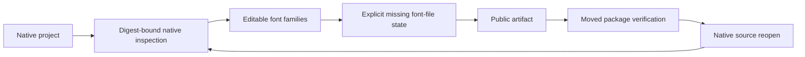

# ArtCraft font dependency state

Current source candidate extends `craft-artifact/v1` with explicit unresolved font requirements. It is not yet included in plugin137/source109/runtime136. Task2.3 and complete V1 remain open.

PhotoCraft public workflow reads the digest-verified `native.json`, collects `Type` layer font families (including hidden layers and nested `layers`), and binds each requirement to the native project digest and inspection evidence. Invalid or absent editable font names refuse publication. Pixel layer names are not font evidence. Other domain font mappings and font-file packaging remain pending.

An unresolved dependency uses `assetRef: null`, `kind: font`, `packaged: false`, `missingReason: font_file_not_collected`, and `fontRequirement: {family, nativeProjectSha256, inspectionRef}`. Null is permitted only for this complete unresolved state. The inspection reference must occur exactly as declared in the artifact evidence and the project digest must match its native reference. A font family query does not establish a binary identity, license, installed target font or portable editable typography.

Existing non-null dependency records remain accepted. Older strict consumers may reject the new form; distribute producer and consumer together using a new immutable runtime/source/plugin chain. Do not retrofit old release acceptance records or upgrade a missing state to packaged.

The full runtime regression and a bounded actual Photo native creation, moved-package verification and source-reopen check validate this candidate. Source-reopen uncovered a real preflight issue: per-file integrity checks inherited project-level font requirements while removing their native reference. Per-file checks now clear dependencies after the original full source artifact has been verified. The source artifact itself retains all requirements.

Evidence is recorded in `docs/evidence/font-dependency-candidate-20261009.json`. Controlled package tests do not prove target-machine font availability. Retained actual native outputs and failure receipts remain outside Git. No numbered task is completed by this candidate alone.
