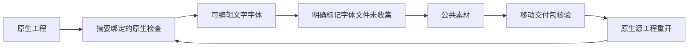

# ArtCraft 字体依赖状态

当前源码候选为 `craft-artifact/v1` 增加明确的未收集字体需求；尚未进入 plugin137／source109／runtime136。任务2.3与完整V1继续开放。

PhotoCraft 公开工作流读取摘要核验通过的 `native.json`，收录 `Type` 图层的字体名称，包括隐藏图层和嵌套 `layers`，并绑定原生工程摘要与检查证据。可编辑文字字体名称缺失或无效时拒绝发布；像素图层名称不是字体证据。其他领域的字体映射与字体文件打包仍待完成。

未收集依赖使用 `assetRef: null`、`kind: font`、`packaged: false`、`missingReason: font_file_not_collected`，以及 `fontRequirement: {family, nativeProjectSha256, inspectionRef}`。null 仅允许用于这一完整缺失状态；检查引用必须按原值存在于公共 evidenceRefs，工程摘要必须匹配 nativeProjectRef。字体名称查询不能证明字体文件身份、授权、目标机器安装情况或可编辑排版可迁移。

既有非空依赖记录继续接受。旧严格消费者可能拒绝新增形式；后续需要新不可变运行时、独立技能与插件发行链配套发布，不能修改旧发行验收记录或把缺失状态升级成已打包。

候选以完整运行时回归和有界真实 Photo 原生创建、移动包核验、源工程重开验证。重开暴露了真实预检问题：逐文件完整性检查在移除原生引用时仍继承工程字体需求。现改为先完整验证源素材，再在逐文件检查对象中清空工程依赖；原始公共素材的字体需求仍完整保留。

证据见 `docs/evidence/font-dependency-candidate-20261009.json`。受控打包测试不证明目标机器字体可用；真实工程、失败回执与媒体保留在 Git 外。不能仅据此勾选任何编号任务。
