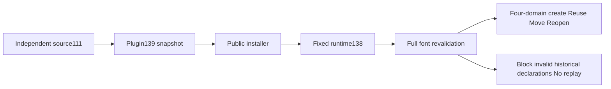

# ArtCraft fixed font-reuse acceptance

Plugin139/source111/runtime138-runtime.1 are immutable development prereleases. All three GitHub asset digests match local bundles. Only the font-reuse increment is qualified; the complete artifact protocol and V1 remain open.

Two preserved behavioral failures showed missing historical font declarations being accepted on same-revision resume and cross-revision reuse. Fresh public results, resume, cache hits and downstream handoffs now compare full font declarations and missing states. Omitted, duplicate, extra or incorrectly referenced requirements block reuse without rewriting history or replaying native operations. Fontless projects with valid full evidence remain reusable.

| Evidence | Result |
| :--- | :--- |
| Full runtime regression |654 passed,26 conditional skips|
| Fixed runtime targets |51 passed; an initial missing JPEG fixture was supplied before all51 were rerun successfully|
| Plugin Python |112 passed,11 skipped|
| Independent skills Python |162 passed,53 skipped|
| Single skill from pluginZIP, public entry |Four-domain creation, same-revision reuse, moved package, four source reopens and re-export/repackage passed|

Native acceptance used a warm runtime cache and preserved skill/source hashes. It does not qualify cold-cache installation, host64, font-binary collection or target typography. Immutable identities, log digests, native and package hashes are in the [evidence](evidence/font-reuse-fixed139-20261009.json).

The continued audit confirmed incomplete public dependencies in three reopened children: poster and intro inherit Logo media, while film inherits intro and voice. Collected files and manifest.assets remain present, but public dependencies contain only font records. Physical packaging and successful native reopening do not qualify this field. Next work must preserve verified collected media/LUT identities, versions and packaging states through repeated reopens and replacement. Task2.3 remains open.
