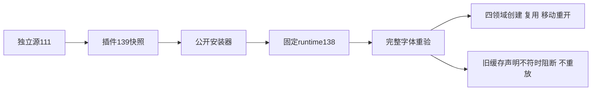

# ArtCraft 字体复用固定发行验收

插件139／独立源111／runtime138-runtime.1 已发布为不可变开发预览，三个GitHub附件摘要与本地包一致。当前只完成字体复用增量，完整公共素材协议与V1继续开放。

旧产物省略字体清单时，同修订恢复和跨修订复用曾错误返回review_ready；两项行为红灯已保留。修复在新公共结果、恢复、缓存命中及下游交接核验完整字体声明与缺失状态，阻断遗漏、重复、额外或错误引用；保留旧记录、不重放原生操作。无文字且完整证据有效的工程仍可复用。

| 证据 | 当前结果 |
| :--- | :--- |
| 运行时完整回归 |654通过、26条件跳过|
| 固定运行时目标 |51通过；首次缺JPEG夹具，补齐后51项重跑通过|
| 插件Python |112通过、11跳过|
| 独立技能Python |162通过、53跳过|
| 插件ZIP单技能公开入口 |四领域创建、同修订复用、移动包、四源重开及再导出／打包通过|

原生验收使用既有运行时缓存，技能与源文件摘要保全；不代表空缓存、64宿主矩阵、字体文件收集或目标机器排版一致。固定包身份、日志、原生摘要与包摘要见[证据](evidence/font-reuse-fixed139-20261009.json)。

逐项审计又确认三个重开子工程的公共依赖清单不完整：海报和片头各继承Logo媒体，影片继承片头与配音；manifest.assets与文件仍存在，但公共dependencies只有字体记录。这是公共依赖字段的实现差距，不能用物理文件已打包或原生重开成功代替验收。下一步需从已核验的收集事实保留媒体／LUT等依赖身份、版本和打包状态，并验证多次重开和替换；任务2.3保持未完成。
