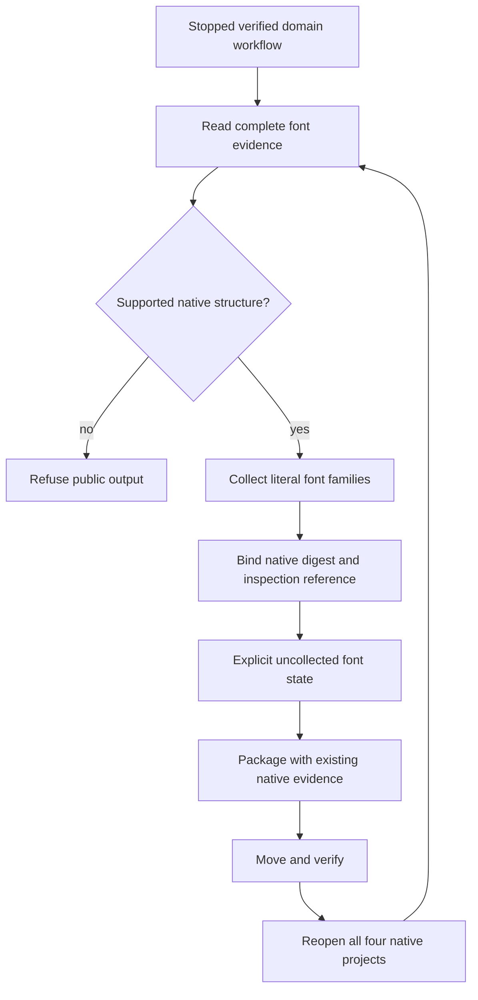

# ArtCraft four-domain font dependencies

The current source candidate records explicit uncollected font requirements for all four domains. The new fixed runtime/source/plugin chain is being prepared; fixed installation acceptance is pending. Task2.3 and complete V1 remain open.

| Domain | Authoritative font evidence | Coverage |
| :--- | :--- | :--- |
| Photo | Digest-verified native.json | Type layers including hidden layers and nested layer groups |
| Vector | Digest-verified native.json | Full tree of text runs, including grouped and hidden text |
| Film | Exact bytes of schema12 project.fcproj | Captions, graphic font parameters, character overrides and font parameter keyframes |
| Effect | Exact bytes of schema1 project.ecproj | Full typed TextDoc values, character styles and all keyframed text values |

Film and Effect simplified inspections omit font information. Their complete native JSON files are the font inspection evidence, without adding sidecars or changing domain delivery manifests. Only font fields are consumed; parsed time values are never used to rewrite or normalize the native project. Original bytes and digests remain authoritative, including ticks beyond safe JSON integers.

Uncollected dependencies retain `assetRef=null`, `kind=font`, `packaged=false`, `missingReason=font_file_not_collected`, and `fontRequirement={family,nativeProjectSha256,inspectionRef}`. The native digest and exact inspection reference are checked. Font family records never stand for packaged font binaries, installed target fonts, licenses or approved typography. Character style and variation details remain in the digest-bound native evidence; a family requirement does not claim that a specific font face was collected.

The known Film schema12 default for a graphic text layer without a font parameter is Inter. Effect legacy string Source Text values, including keyframes, use the native TextDoc::plain Inter default. Unknown text types, malformed families and unsupported native schema versions refuse publication. Input JSON is bounded to16MiB before reading, traversal to128 levels and1,000,000 nodes; current native runtime pins bound these mappings. This covers recorded literal fonts, without claiming dynamic expression-generated font resolution.

Current-source runtime regression:644 passed,26 conditional skips. Actual native brand creation, moved-package verification, four source reopens and re-exports pass. Logo uses Source Sans3; poster, text intro and captioned film use Arial. The Font boundary tests also cover nested/hidden text, character overrides, future text keys, malformed records and unsupported schemas. See `docs/evidence/four-domain-fonts-candidate-20261009.json`.

Existing non-null dependencies remain accepted. Old strict consumers may reject the null-font form, so runtime, independent skills and plugin must be published as one pinned development chain. Remaining acceptance includes that immutable distribution, the full CP-002 scenario matrix and target environment checks. These bounded results do not complete task2.3 or V1.
