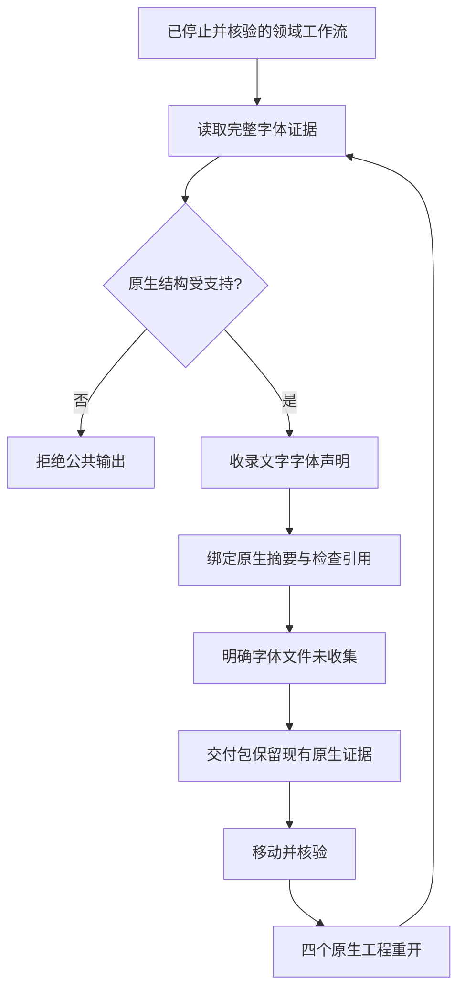

# ArtCraft 四领域字体依赖

当前源码候选已为四领域记录明确的字体文件未收集状态。正在准备新的固定运行时、技能源与插件发行链；固定安装验收尚待完成。任务2.3与完整V1继续开放。

| 领域 | 字体事实来源 | 覆盖 |
| :--- | :--- | :--- |
| Photo | 摘要核验的 native.json | Type 图层，含隐藏图层和嵌套图层组 |
| Vector | 摘要核验的 native.json | 完整文字运行树，含分组与隐藏文字 |
| Film | schema12 的 project.fcproj 原始字节 | 字幕、图形字体参数、字符覆盖样式和字体参数关键帧 |
| Effect | schema1 的 project.ecproj 原始字节 | 完整 TextDoc 值、字符样式和全部文字关键帧 |

Film、Effect 的简化检查会遗漏字体信息，因此以完整原生 JSON 文件本身作为字体检查证据，无需新增旁路文件或修改领域交付清单。只消费字体字段；解析得到的时间数值不参与重写或归一化原生工程。包括超出 JSON 安全整数的 ticks 在内，原始字节与摘要始终是事实源。

未收集依赖保留 `assetRef=null`、`kind=font`、`packaged=false`、`missingReason=font_file_not_collected`，以及 `fontRequirement={family,nativeProjectSha256,inspectionRef}`；核对原生摘要与完整检查引用。字体名称记录不代表字体二进制、目标机器安装、授权或排版审阅通过。字符样式和变量轴细节仍保留在摘要绑定的原生证据中，字体族需求不声称具体字体文件已收集。

已知 Film schema12 的图形文字缺省字体参数使用 Inter；Effect 旧字符串 Source Text（包括关键帧）按原生 TextDoc::plain 使用 Inter。未知文字类型、错误字体记录和不支持的原生 schema 版本拒绝发布。JSON 读取前限制16MiB，遍历限制128层与1000000节点；映射绑定当前原生运行时版本。覆盖已记录的文字字体声明，不声称已解析表达式动态生成的字体。

当前源码完整运行时回归644通过、26条件跳过；真实品牌工程创建、移动包核验、四个源工程重开与重新导出通过。Logo 使用 Source Sans3；海报、文字片头和字幕影片使用 Arial。字体边界测试还覆盖嵌套／隐藏文字、字符覆盖、后续关键帧、无效记录与不支持的 schema。见 `docs/evidence/four-domain-fonts-candidate-20261009.json`。

既有非空依赖继续接受；旧严格消费者可能拒绝 null 字体形式，因此运行时、独立技能与插件需要配套固定发行。剩余验收包括该不可变发行链、完整 CP-002 场景矩阵和目标环境检查。本次有界结果不代表任务2.3或V1完成。
