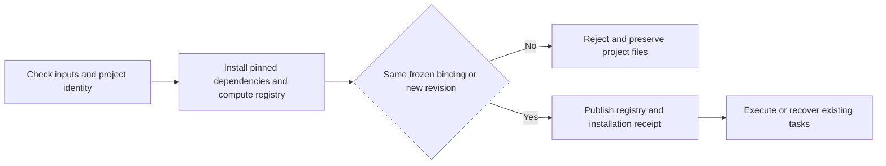

# ArtCraft Frozen Revision Metadata Architecture

## Scope and authority

OpenSpec AC-TX-001-META and task 5.10 govern this increment. Skill candidate dev.23 retains orchestration runtime dev.16. All ten independent skills carry the same public workflow.py without sibling directory dependencies.

## Behavior and technical design

The old entry point published a new installation receipt and registry before checking the frozen revision binding. A changed actual runtime registration could therefore modify project metadata even when the request was rejected. The entry point now computes and validates the plan, registry, owner and authorization binding before publishing installation identity and running native tasks. Cache installation can establish the actual identity; a rejected cache registration does not become the project's current registration.

## Verification and limits

The mocked identity-change regression failed before the fix: one failure among three tests. Current default regression runs 59 tests, with 48 passes and 11 gated skips in 5.093 seconds. The separately executed public-download single-skill test runs three tests successfully in 92.662 seconds. It creates four editable native projects, replays the same revision, changes the cache to trigger a binding conflict, checks the complete original project file inventory and hashes, and verifies a relocated delivery package.

Evidence: [hash-bound record](evidence/frozen-revision-metadata-first-use.json). Immutable installed-plugin retesting is currently NOT_RUN. Audio is a synthetic fixture; this does not establish creative, human or model-dispatch acceptance. Concurrent metadata publication and other platforms remain outside this proof.

Published skills dev.23 / plugin dev.25 pass immutable installed single-skill cold native retesting with default Python 3.14.3: 3 tests, 90.697 seconds. All 58 installed skill hashes remain unchanged. The earlier NOT_RUN statement describes the candidate checkpoint. Evidence: [fixed host and native proof](evidence/codex-release27-binding-metadata-20261006.json).
