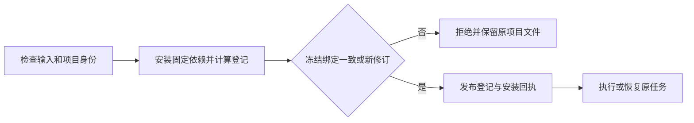

# ArtCraft 冻结修订元数据架构

## 范围与事实源

OpenSpec AC-TX-001-META、任务 5.10 管理本增量。技能候选 dev.23，编排运行时仍为 dev.16。十个技能各自携带同一公开 workflow.py，不依赖兄弟技能目录。

## 行为与技术方案

旧入口先写入新的安装回执和登记表，再检查冻结修订绑定。切换实际运行时登记后，请求虽然被拒绝，原项目资料已经改变。现在先计算并核对计划、登记、所有者和授权的绑定，校验通过才发布安装身份并运行原生任务。缓存安装用于获取实际身份，拒绝请求的缓存不成为项目当前登记。

## 验证与限制

修复前模拟身份变更测试确实失败：3 项中 1 项失败。修复后默认回归 59 项，48 项通过、11 项门禁跳过，耗时 5.093 秒。独立技能默认公开下载首次使用另行执行，3 项通过，耗时 92.662 秒。真实测试创建四个原生工程，重放同修订，切换缓存触发冲突并核对原项目所有文件清单与摘要，随后验证移动交付包。

证据：[摘要绑定记录](evidence/frozen-revision-metadata-first-use.json)。当前固定发布插件安装复验为 NOT_RUN。测试音频是合成 fixture；不证明创作、人工或模型调度验收。本改动不声称覆盖并发元数据发布或其他平台。

已发布技能 dev.23／插件 dev.25 的实际安装单技能冷启动原生复验通过：默认 Python 3.14.3，3 项测试，90.697 秒；全部 58 个安装技能摘要不变。上文 NOT_RUN 是候选检查点。证据：[固定宿主与原生复验](evidence/codex-release27-binding-metadata-20261006.json)。
