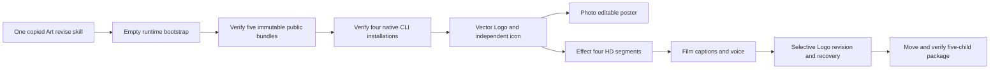

# ArtCraft HD First Use Architecture

Date: 2026-10-07. Independent skill source dev.48 pins runtime dev.71, Film skills dev.11, Effect skills dev.10 and Photo/Vector skills dev.10. Specification authority remains the Art plugin establish-v1-plugin / AC-DM-004 / release task 6.47. This document describes the fixed public-source cold path; installed-host acceptance is still pending.

The self-contained segmented-hd-brand-campaign example creates four native domain projects and an independent icon. Provided assets are a five-second WAV and 1920×1080 background. The default public download path is used with a restricted system PATH, without archive overrides or sibling Art skills. SKILL_DIR resolves to the actual loaded skill directory. The private test oracle uses Pillow and ffmpeg/ffprobe; these do not replace native rendering.

[Source first-use evidence](evidence/art-segmented-hd-source-first-use-20261007.json) passes one native case in 214.879 seconds. All 120 source frames are independently decoded; a full five-second, 24 fps, 1080p video decode and eight pixel checks include the animated Logo. Logo replacement rebuilds logo/poster/intro/film and reuses independent work. Original inputs, deliveries, background, voice and initial transparent frame remain intact. Corrupted segment refusal and restoration retain original task IDs and budget. The final five-child package relocates and verifies. Every copied and original skill file retains its hash.

The unchanged per-segment 512 MiB budget bounds decoding; logical total limits remain 64 GiB / 10,000 frames and 2 GiB encoded bytes. Missing bundles, digest mismatch or invalid media must fail rather than trigger an unverified build. Revision identity and verified child hashes control reuse; a corrupt frame blocks downstream reuse until restored. No mutable latest tag is used.

Default source tests: 75 pass / 27 conditional skips. Fixed bundle rebuild and three newly published archive byte/file validations pass. These proofs do not establish final Codex plugin installation, 58 individual cold starts, generic Skills CLI installation, model dispatch, GUI, creative approval or full V1. Task 6.47 remains open until its installed release gates pass. Earlier candidate evidence remains version-bound.
