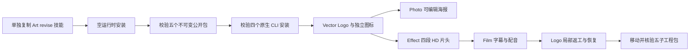

# ArtCraft HD 首次使用架构

日期：2026-10-07。独立技能源 dev.48 固定 runtime dev.71、Film 技能 dev.11、Effect 技能 dev.10、Photo／Vector 技能 dev.10。规格事实源仍为 Art 插件 establish-v1-plugin／AC-DM-004／发行任务 6.47。本文描述固定公开技能源冷启动路径，安装宿主验收仍待完成。

自包含 segmented-hd-brand-campaign 示例创建四个领域原生工程及独立图标，输入为五秒 WAV 与 1920×1080 背景。测试使用默认公开下载和受限系统 PATH，不使用归档覆盖或兄弟 Art 技能。SKILL_DIR 指向实际加载的技能目录。独立测试判据使用 Pillow、ffmpeg／ffprobe，不替代原生渲染。

[源码首次使用证据](evidence/art-segmented-hd-source-first-use-20261007.json) 一项原生用例在 214.879 秒通过。120 帧源图全部独立解码，五秒／24 fps／1080p 成片完整解码，八项像素检查包含动态 Logo。替换 Logo 重建 logo／poster／intro／film，独立任务复用。原始输入、交付、背景、配音和初始透明帧保持不变；损坏分段拒绝，恢复后原任务 ID 与预算不变。最终五子工程交付包移动后校验通过，复制及原技能全部文件摘要保持一致。

每段 512 MiB 的解码预算保持不变；整体逻辑上限为 64 GiB／10,000 帧、编码 2 GiB。缺少发行包、摘要错误或无效媒体必须失败，不转为未验证源码构建。修订身份与子文件摘要控制复用；损坏帧恢复前阻止下游复用。不使用可变 latest 标签。

默认技能源测试为 75 通过／27 项条件跳过；固定包重建及三个新公开包的归档／文件校验通过。这些证明不包含最终 Codex 插件安装、58 次独立冷启动、通用 Skills CLI 安装、模型调用、GUI、创作审批或完整 V1。任务 6.47 等待安装发行门禁完成后再关闭，历史候选证据保持原版本范围。
