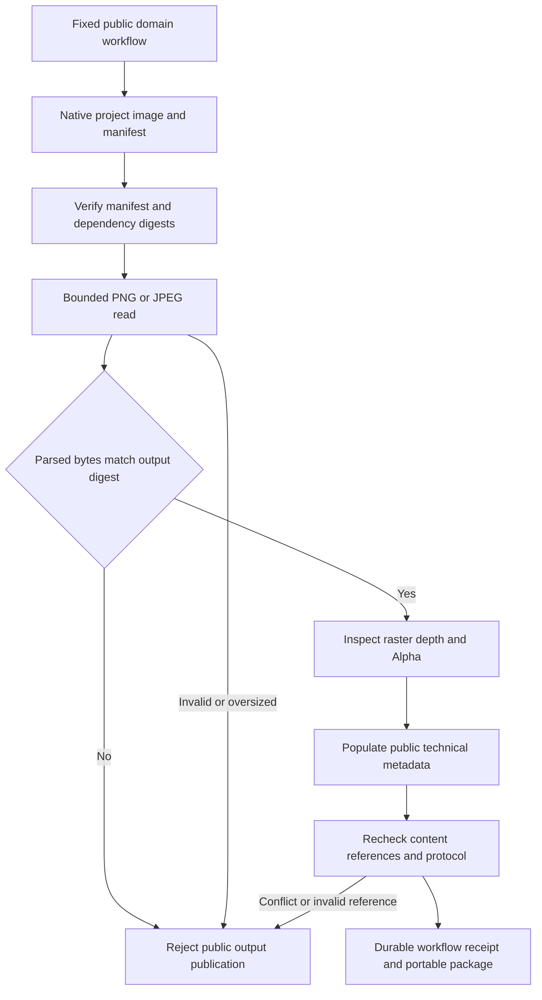

# ArtCraft derived image metadata architecture

Status: fixed runtime125 / independent source97 / plugin125, with installed technical acceptance passed. Full artifact protocol task2.3 remains open.

## Contract and use

The plugin OpenSpec `AC-CP-002-IMAGE` owns this behavior. PNG/JPEG outputs from PhotoCraft, VectorCraft and EffectCraft public workflows carry encoded raster `width`, `height`, `bitDepth` and `alpha` in `technicalMetadata`. Consumers read `nodes.<id>.outputs` in the workflow receipt; no new domain command is required.

A PNG can report `{"width":320,"height":400,"bitDepth":8,"alpha":false}`. MIME alone cannot establish an Alpha representation. JPEG reports `alpha:false`. Unknown `colorSpace` is omitted, as are inapplicable timing and audio fields.

## Data flow and failures

The adapter reuses existing PNG/JPEG inspectors. An optional expected digest binds facts to the actual bytes inspected; ordinary artifact verification supplies it too. Existing call signatures remain compatible. Native project, source, dependency, exchange-loss and manifest references retain their existing verification path. Final public protocol verification checks declared facts against content again.

PNG CRC, chunk, decompressed scan, color and depth checks retain the 64MiB encoded / 128MiB scan limits. JPEG marker checks retain the 64MiB and supported-process boundaries. Alpha representation does not prove visible transparency. JPEG marker inspection does not prove entropy decoding, applied EXIF orientation or ICC fidelity.

## Verification and delivery gates

The target test first reproduces empty public image metadata. Tests cover three adapters, PNG, baseline/progressive/gray/CMYK JPEG fixtures, invalid contents and digest mismatch. Fixtures do not substitute for native exports.

The native mixed test uses fixed public domain packages and adds Photo JPEG and Effect PNG preview outputs. An independent decoder checks dimensions and Alpha representation. Logo revisions, native source revisions, historical preservation, reuse, moved packages and reopening remain covered. Film explicitly selects the intro video so an unused preview cannot fabricate lineage.

Fixed installed evidence: `docs/evidence/craft-art125-image-metadata-fixed-first-use-20261008.json`. All64 host skills discovered, zero loading errors; ten Art skills independently cold installed;64 installed CLI probes; installed image and Film first use plus four-domain mixed revision/reuse/moved-package verification pass. Three public archives byte-match and five fixed bundles rebuild exactly. Eight fixed-commit CI runs pass. Native large-integer timing handoff and the full protocol scenario matrix remain open.

[Fixed evidence](evidence/craft-art125-image-metadata-fixed-first-use-20261008.json).

The color fixture was corrected before source97; visible-frame selection was corrected in the test driver after that tag. Released skill bytes were not changed; installed acceptance binds the actual driver hash. Alpha representation, JPEG markers and raster facts do not establish creative, color-fidelity or human acceptance.

The current whole-working-copy source audit refuses an overall conclusion: the four other domain working copies differ from pinned tags; ArtCraft tracked skill files match source97. Installed acceptance binds fixed releases. Other domain working copies were not modified to satisfy the audit.
