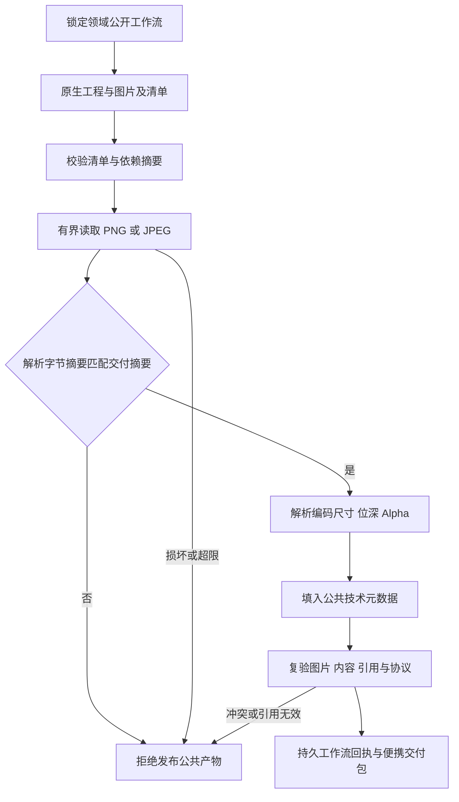

# ArtCraft 派生图片元数据架构

状态：固定runtime125／独立源97／插件125，安装后技术验收通过。完整素材协议任务2.3保持开放。

## 合同与使用

事实源为插件的 OpenSpec `AC-CP-002-IMAGE`。PhotoCraft、VectorCraft、EffectCraft 经 ArtCraft 公开工作流交付 PNG/JPEG 时，输出素材的 `technicalMetadata` 包含编码栅格的 `width`、`height`、`bitDepth`、`alpha`。调用方通过工作流回执的 `nodes.<id>.outputs` 读取，不需要新的领域命令。

例如 PNG 的元数据可以是 `{"width":320,"height":400,"bitDepth":8,"alpha":false}`。PNG 允许没有 Alpha 通道；不能仅凭 MIME 推断透明度。JPEG 的 `alpha` 为 `false`。无法确认的 `colorSpace` 省略，图片不添加不适用的时间或音频字段。

## 数据流与失败路径

适配器复用既有 PNG/JPEG 检查器，检查器的可选预期摘要把属性绑定到实际解析字节。普通素材核验同样传入预期摘要。现有调用签名兼容；原生工程、来源、依赖、交换损失与清单引用保持原有核验路径。最终公共协议再次检查属性声明与实际内容。

PNG 检查 CRC、块边界、解压扫描数据及合法颜色类型和位深，文件64MiB／扫描128MiB限制继续生效。JPEG 检查标记和编码栅格，既有64MiB与支持过程边界保持。Alpha 表示不证明实际可见透明像素；JPEG 标记检查不证明熵数据可解码、EXIF方向应用或ICC保真。

## 验证与交付门禁

目标测试先复现公开图片元数据为空；覆盖三个适配器、PNG、JPEG基线／渐进／灰度／CMYK语料、损坏内容以及摘要变化拒绝。夹具不替代原生导出。

原生混合测试使用固定公开领域包，增加 Photo JPEG 与 Effect PNG 预览交付，并用独立解码器核对栅格和 Alpha 表示；验证 Logo 修改、源工程修改、历史文件保全、复用、移动打包与重开。Film 必须显式选择片头视频，不能把未消费的预览图制造为输入血缘。

固定安装证据见 `docs/evidence/craft-art125-image-metadata-fixed-first-use-20261008.json`。64宿主技能发现、零加载错误；十Art技能各自空缓存安装；64安装CLI探测；安装后的图片与Film专项、四领域混合返工／复用／移动包通过。三个公开包逐字节匹配，五个固定包重建一致，八项固定提交CI通过。原生大整数时间交接与完整协议矩阵继续开放。

[固定证据](evidence/craft-art125-image-metadata-fixed-first-use-20261008.json).

默认颜色夹具在源97标签前修正，可见帧选择在标签后的测试驱动修正；发行技能字节未改写，安装复验绑定实际驱动摘要。Alpha 表示、JPEG 标记与栅格事实不证明创作、颜色保真或人工验收。

当前全工作副本来源审计拒绝整体结论：其他四领域工作副本已偏离固定标签；ArtCraft受控技能文件与源97一致。以上安装结论只绑定固定发行，未修改其他领域工作副本以通过审计。
