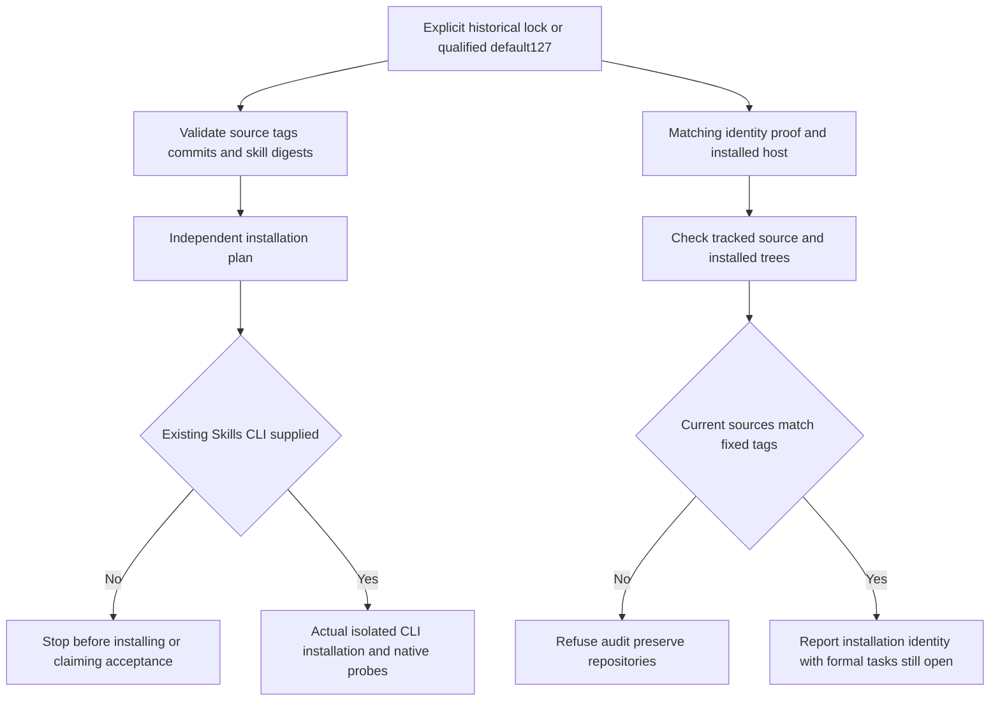

# ArtCraft Independent Install Default Identity Architecture

> Scope: correct stale defaults for installation planning, installed CLI verification and completion auditing while preserving full installation gates.
> Version: 1.0.0 · Updated: 2026-10-09

## 1. Decision and authority

Qualified plugin dev.127/source dev.99 existed while three maintainer tools defaulted to dev.126. Three targeted assertions first failed on the stale identity; all 33 targeted tests pass after correction. Tasks 3.4/3.5 are complete; the plugin OpenSpec skills-distribution contract remains authoritative. Tasks 3.6 and 3.16 remain open. Production skill/runtime bytes are unchanged; no new installation asset version is needed.

## 2. Default selection and control flow

Tools explicitly pin the qualified host-acceptance-art127.lock.json; completion auditing also binds craft-art127-installation-identity-20261009.json. Defaults advance after host qualification. Explicit historical locks/evidence remain supported for historical verification. Source, digest and directory boundary checks remain intact.

## 3. Evidence

| Layer | Result and boundary |
|:---|:---|
| Red/green | Default126 causes three failures; corrected defaults pass all33 targeted tests; historical explicit arguments stay compatible. |
| Plugin regression | 112 tests: 106 passed, six conditional skips. |
| Fixed independent entries | Ten source99 standalone skills pass20 public version/help calls using their separately cold-installed caches; this is not a new cold run. |
| Dependency failure path | Copy each fixed host skill alone:20 actual workflow/package calls across ten skills with an invalid-lock fault return their own bootstrap path, without sibling access or runtime creation. |
| Current identity aggregation | Ten source99 public cold records and54 byte-identical historical domain cold records remain distinct;64 current installed trees are rehashed. No claim of64 new cold installs. |
| Completion audit | Actual default invocation refuses four domains with audit_tracked_source_drift and writes no success report. Art tracked source matches its fixed tag; ignored caches are reported separately. Other repositories remain untouched. |

[Correction evidence](evidence/independent-install-defaults-fixed127-20261009.json) binds red/green logs, source fingerprints, actual calls and audit refusal. [Current identity evidence](evidence/craft-art127-installation-identity-20261009.json) retains the54 historical/10 public-cold distinction and exact version identities.

## 4. Remaining gates

No executable generic Skills CLI is present in the current environment. No tool was installed, and standalone copies/diagnostic tests do not substitute for actual CLI installation. Task3.16 still requires installing five fixed sources into isolated .agents/skills, checking all64 digests and native versions;3.6 stays open. Whole-workspace source refusal remains valid; host identity cannot replace tracked-source consistency. Fifteen numbered tasks remain. FullV1, model dispatch, GUI, human acceptance and other-platform acceptance remain open.

---
Document version: 1.0.0 · Created/updated: 2026-10-09 · Status: maintainer fix verified; full independent-install acceptance open.
