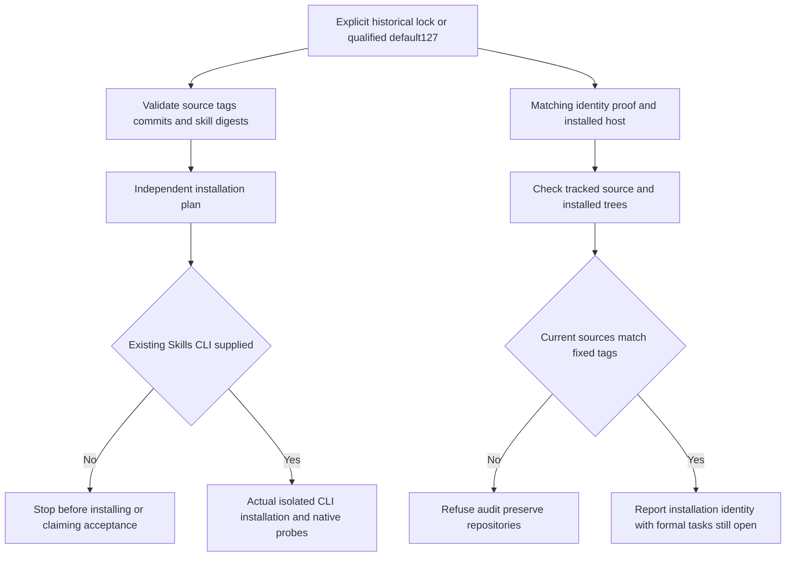

# ArtCraft 独立安装默认身份架构

> **文档说明**：修正独立安装计划、安装副本 CLI 验收与完成审计的过期默认身份，保留完整安装门禁。
> **版本**：V1.0.0
> **最后更新**：2026-10-09

## 1. 结论与事实源

已验收插件 dev.127／技能源 dev.99，三项维护工具原默认 dev.126。三个目标断言先因版本不符失败，修复后 33 项目标测试通过；任务 3.4／3.5 完成。行为事实源是插件 OpenSpec 的 skills-distribution；3.6 与 3.16 保持开放。生产技能与运行时字节不变，不新建安装包版本。

## 2. 默认选择与控制流

维护工具采用明确固定的已验收 host-acceptance-art127.lock.json，完成审计同时绑定 craft-art127-installation-identity-20261009.json。新分发经宿主验证后再更新默认值；明确传入历史锁及证据仍支持历史复核。安装计划、来源验证、摘要与目录边界逻辑保留。

## 3. 验证证据

| 层次 | 结果与限制 |
|:---|:---|
| 红绿测试 | 原默认126导致3项失败；修复后33项通过；显式历史参数兼容。 |
| 插件回归 | 112项：106通过、6条件跳过。 |
| 固定独立入口 | 当前源99十项独立技能在各自已冷安装缓存中，20次公开版本／帮助调用通过；本轮不称新冷安装。 |
| 安装失败路径 | 从固定宿主逐项只复制一个技能，十项技能的 workflow/package 共20次真实公开调用注入无效锁，返回自身bootstrap路径，不访问兄弟目录、不创建运行时。 |
| 当前身份聚合 | 十项源99公开冷证据与54项内容未变的领域历史冷证据分别保留，64项当前安装树重新核验；不称64项本轮新冷安装。 |
| 完成审计 | 实际默认调用拒绝四领域 audit_tracked_source_drift，不写成功报告；Art跟踪源与固定标签匹配，忽略缓存另行报告。未修改其他仓库。 |

[修复证据](evidence/independent-install-defaults-fixed127-20261009.json) 包含红绿日志摘要、源码指纹、调用证明及审计拒绝；[当前身份](evidence/craft-art127-installation-identity-20261009.json) 保留54历史／10公开冷证据与精确版本绑定。

## 4. 剩余门禁

当前环境未发现可执行的通用 Skills CLI；没有安装新工具，也没有把独立复制或诊断测试当成实际安装。3.16需要真实CLI将五套固定来源安装到隔离 .agents/skills，核对全部64项摘要及原生版本；3.6完整安装验收继续开放。全工作区审计拒绝保持有效，不能用宿主身份通过替代跟踪源一致性。现余15项编号任务；完整V1、模型派发、GUI、人工接受与其他平台未由本次修复关闭。

---

**文档版本**：V1.0.0
**创建日期**：2026-10-09
**最后更新**：2026-10-09
**文档状态**：维护工具修复已验证，完整独立安装验收开放
