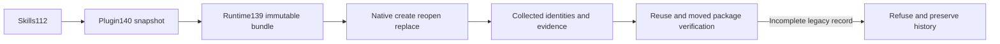

# ArtCraft inherited dependency fixed-release acceptance

Plugin140 / independent source112 / runtime139-runtime.1 are immutable development prereleases. GitHub asset sizes and SHA-256 digests match all three local ZIPs. Plugin and runtime each passed four GitHub checks; source has no configured CI.

Both the independent skill and the actual plugin ZIP skill passed the public installer workflow using a warm native cache: four-domain creation, same-revision reuse, two successive source reopens, media/LUT identity retention, Effect media replacement and reuse, moved-package verification, and rejection of an incomplete package. Source projects, media, LUT bytes and copied skills remained unchanged.

The fixed plugin additionally passed actual segmented-sequence collection, Film source reopening and moved-package verification. The normalized descriptor uses its collected digest; original descriptor lineage is retained. This 320×180 /12fps /12-frame probe verifies identity and is not HD acceptance. The first QA invocation referenced a nonexistent frameCount metadata field; corrected QA used the actual rational frameRate. The initial result remains retained and is not a product failure.

Runtime regression:669 passed /26 conditional skips; fixed-runtime targets:78 passed; source Python:162 passed /53 skipped; plugin Python:112 passed /11 skipped. Evidence binds immutable release commits, ZIP digests, native proof and log digests. See [fixed evidence](evidence/inherited-dependencies-fixed140-20261009.json).

Only scoped task2.10 completes. Full CP-002 task2.3 requires a current complete scenario audit; full V1, general Skills CLI installation, target platforms, host-wide and creative acceptance remain open. Historical evidence and immutable tags are preserved; post-release checkpoint documentation is not part of the already tagged ZIPs.
