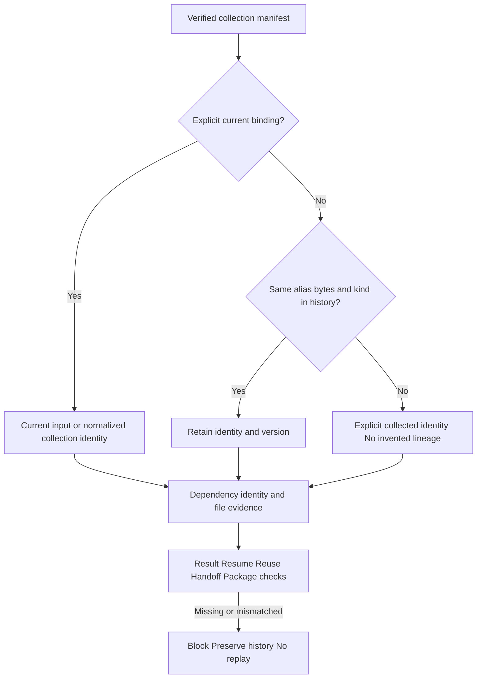

# ArtCraft inherited public dependencies

The current candidate fixes collected media/LUT files being omitted from public dependencies after source reopen. The fixed plugin139/source111/runtime138 public entry reproduced empty non-font dependencies for reopened poster, intro and film. Task2.3 and full V1 remain open; fixed distribution acceptance is pending.

Mapping enumerates verified manifest.assets rather than only current explicit inputs. Current bindings use current input identities. Unchanged inherited bytes recover identities and versions from prior dependencies or verifiable sourceRefs. Multiple known identities for identical content are retained and exact identity/version/digest/kind duplicates are removed. Unknown historical provenance produces an explicit collected identity with the actual byte digest as version, never invented original-input lineage. Explicit replacement uses the new input identity and drops removed collected records. LUTs retain their type.

No public protocol fields are added: dependencies.assetRef retains its three-field identity and a matching identity/version/digest evidenceRef supplies the relative file location. Generic verification protects paths, actual hashes and read-time changes. Normalized sequence descriptors reference actual collected bytes; original inputs remain in sourceRefs and domain collection evidence.

Fresh results, same-revision resume, cross-revision cache hits and downstream handoffs compare the collected inventory. Direct packaging and moved-package consumption recheck fonts and collected dependencies for public domain children. Incomplete historical deliveries return dependency_manifest_mismatch without metadata rewrites or native replay. Explicit source reopening can generate a complete new record from verified legacy files; historical inputs retained for lineage are not promoted to qualified new child deliveries.

Runtime:669 passed,26 conditional skips. Ten controlled behavioral failures and a real old fixed-entry failure are retained. Actual four-domain creation/reuse/moved packaging/two source reopens, LUT inheritance, Effect media replacement and replacement reuse passed. Four new native packages verify; two fixed139 incomplete historical packages are rejected. See [candidate evidence](evidence/inherited-dependencies-candidate-20261009.json). Normalized sequence mapping has controlled evidence, not a newly executed native-sequence qualification.
