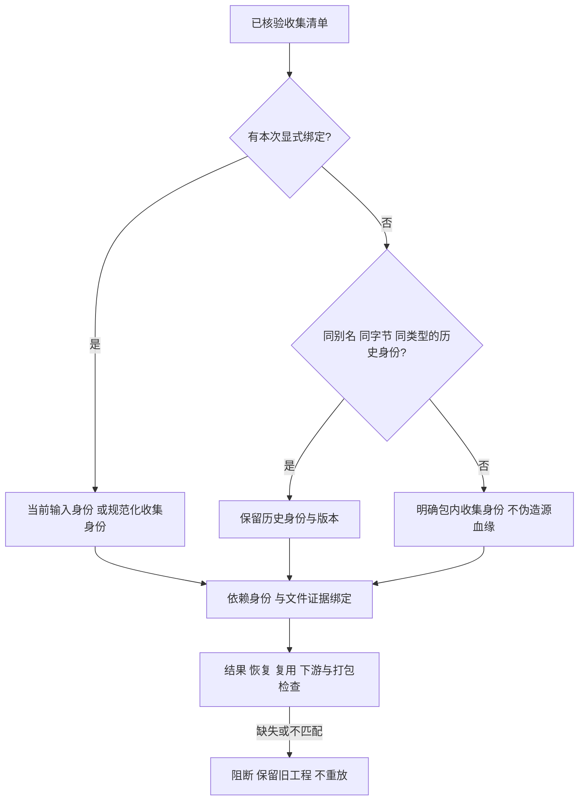

# ArtCraft 继承素材公共依赖

当前候选修复源工程重开后媒体与LUT仍在交付目录、但公共dependencies遗漏它们的问题。固定插件139／源111／runtime138的公开入口已复现：重开后的海报、片头和影片均返回空的非字体依赖。完整V1与任务2.3保持开放，固定发行验收尚待完成。

新映射枚举已核验的manifest.assets，而非仅列本次显式输入。当前绑定采用当前输入身份；未改变字节的继承素材从旧依赖或可核对的旧sourceRefs恢复身份与版本。相同内容的多个已知身份全部保留并按身份／版本／摘要／种类去重。没有历史身份记录时生成明确的collected包内身份，版本取实际文件摘要，不伪造原始输入血缘。显式替换使用新输入身份并删除不再收集的旧记录。LUT保留lut类型。

公共协议没有新增字段：dependencies.assetRef保持现有三字段身份，通过同身份、版本、摘要的evidenceRef关联包内相对位置。通用文件核验检查路径、实际摘要和读期间变更。收集时被规范化的序列描述文件按实际收集字节登记，原始输入保留在sourceRefs及领域收集清单中；不能将规范化字节冒充原摘要。

新结果、同修订恢复、跨修订缓存与下游交接比对收集清单。直接打包和移动包消费也重验公共领域子交付的字体及收集依赖，防止绕过缓存门禁。旧不完整交付返回dependency_manifest_mismatch；不补写旧公共记录、不重放原生操作。显式源重开可在旧文件经核验后生成完整的新记录；包内历史输入可作为血缘保留，不会提升为新合格子交付。

运行时669通过、26条件跳过；10项行为红灯已保留，另有旧固定公开入口的真实遗漏红灯。真实四领域创建、复用、移动包、两次源重开、LUT继承、Effect素材替换及替换后复用通过。新包4次核验通过，固定139的两个历史不完整包均拒绝。详见[候选证据](evidence/inherited-dependencies-candidate-20261009.json)。规范化序列的映射目前有受控证据，不将其写为本次新的原生序列验收。
