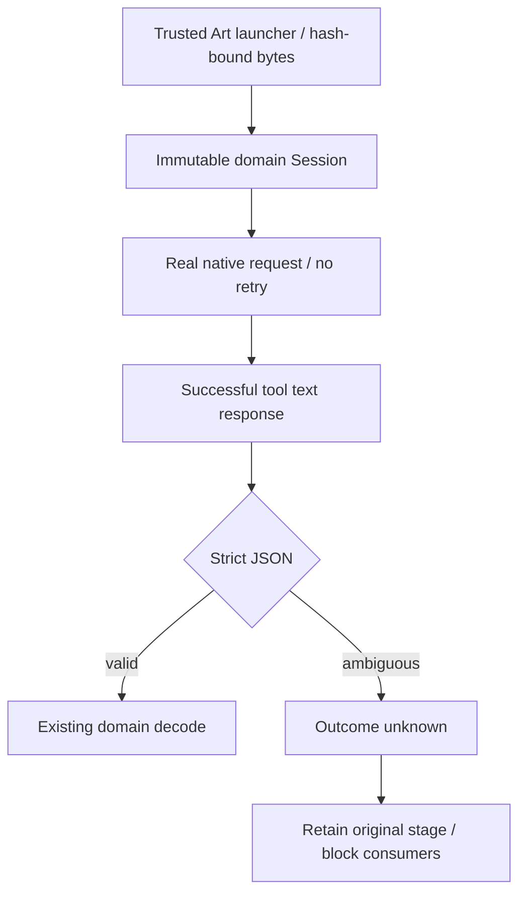

# ArtCraft Inner JSON Boundary Candidate Architecture

Current fixed plugin130/source102/runtime129 fails all12 new post-save inner-JSON cases across four domains. Successful native saves are witnessed before injection; plain json.loads in domain workflow paths accepts nonfinite/overflow/duplicate-key content and execution proceeds to later errors or blocked states. Failure logs and native stages remain retained. Historical Art81 evidence does not establish current fixed behavior.

The candidate adds an Art-owned trusted Python runner. Its generated bytes are included in launcherIdentity; it loads the immutable domain workflow and intercepts only that pinned mcp_session module. Successful tools/call text is decoded with duplicate-key rejection, finite float parsing and parse_constant refusal before domain code sees it. No request is retried. Initialization and native isError replies preserve their existing contract. Domain files remain immutable. A local snapshot guard therefore restores the existing outcome_unknown/failed-stage contract without editing another owner repository.

Candidate evidence:36 actual native post-save fault cases pass, including the prior six fault classes and three new inner-JSON classes per domain; original stages reopen, downstream blocks and save count stays one after repetition. Thirteen controlled boundary vectors cover normal JSON and error/init compatibility. Normal actual EffectCraft render passes1/1. Full runtime regression passes301 with25 conditional skips (326 total). The test source-argv assertion was adjusted to locate the public workflow argument through the owned launcher; native runtime-home override keeps opt-in QA isolated.

All ten installed Art tree hashes and complete pinned bundle/core files remain unchanged. Both original red output and first narrower candidate logs remain separate. This is a working-tree candidate using pinned installed domains; runtimeVersion in its generic raw receipt identifies the installed base, not a new fixed release. INNER-JSON and task4.6 remain open, with8/14 scenarios verified and12 numbered tasks open. New immutable runtime/skills/plugin release, ten cold installs and fixed installed fault/mixed/moved acceptance are still required.

[Candidate evidence](evidence/inner-json-boundary-candidate-20261009.json).
