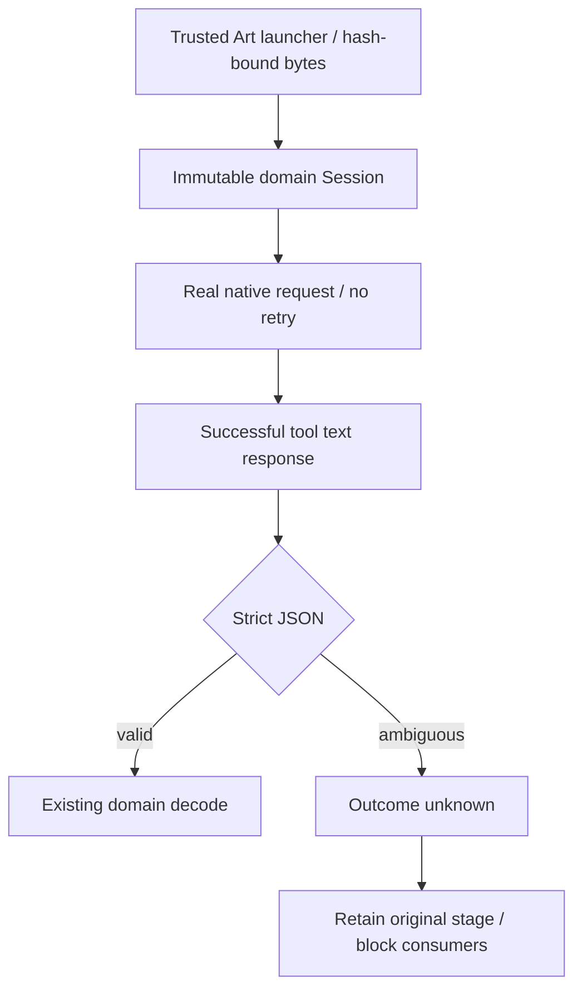

# ArtCraft 内层 JSON 边界候选架构

当前固定plugin130/source102/runtime129在四领域12项新增保存后内层JSON用例中全部未满足预期。注入前已观察到原生保存成功；领域工作流仍有普通json.loads路径，接受非有限／溢出／重复键内容，继续进入后续错误或阻断状态。失败日志及原生暂存保留。历史Art81证据不能证明当前固定版行为。

候选新增Art自有受信Python启动器，生成字节进入launcherIdentity。启动器加载不可变领域workflow，仅拦截锁定mcp_session模块；成功tools/call文本先通过重复键拒绝、有限浮点与parse_constant拒绝，再交给领域代码。请求绝不重试，初始化及原生isError响应保留既有合同，领域文件不变。这在自有调用边界恢复既有outcome_unknown及失败暂存合同，不修改其他责任仓。

候选36项真实原生保存后故障通过，覆盖每领域原六类及新增三类内层JSON；原暂存重开、下游阻断、重复调用保存次数仍为一次。13组受控边界覆盖正常JSON、错误及初始化兼容性。真实EffectCraft正常渲染1/1通过。全量运行时326项中301通过、25条件跳过。测试中的源参数断言改为通过自有启动器定位公开workflow参数，显式运行时目录让原生QA保持隔离。

十项已安装Art目录和全部固定子包／核心文件摘要不变。原始红灯与首次较窄候选日志分别保留。当前证据是工作树候选使用固定安装领域包；通用原始回执中的runtimeVersion表示安装基线，不表示新固定发行。INNER-JSON与4.6保持开放，14场景中8项已验收，12个编号任务开放。后续仍需不可变运行时／技能／插件发行、十技能冷安装及固定安装故障／混合／移动验包。

[Candidate evidence](evidence/inner-json-boundary-candidate-20261009.json).
