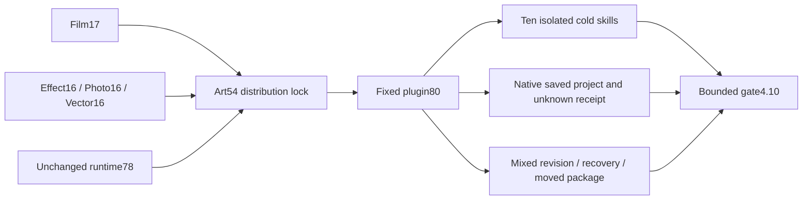

# ArtCraft Inner JSON Distribution Architecture

> Candidate source54 / plugin80; immutable runtime78 reused. Fixed installed gate4.10 pending. Updated: 2026-10-07.

## Authority and versions

OpenSpec AC-RT-002 task4.10 owns this dependency upgrade. Domain sources Film17 and Effect/Photo/Vector16 reject nonfinite numbers, numeric overflow and duplicate keys in command reply text before binding values or writing successful receipts. All48 domain command helpers are locked by full Git ZIP hashes. Runtime78 remains byte-identical because its orchestration code has not changed. Earlier source53/plugin79 distribution locks and installations remain immutable.

## Recovery contract

Complete commands retain `craft-command-receipt/v1`: unknown steps, journal/failure receipts and the original saved files in their output directory. Public creative workflows retain `craft-failed-stage/v1`: a relative pointer to the original stage. Schema determines the recovery location; neither is a successful delivery manifest. Confirm stop evidence, reopen original saved work with a fresh read-only session and preserve the previous attempt. Never delete diagnostics to replay an unknown request.

## Verification boundary

Verify exact fixed host identities, all58 installed skill hashes, the four bundled complete-command helpers through nine native post-save faults each, original project reopening and healthy local revisions. Independently cold-install all ten Art skills. Validate the HD four-domain workflow, affected Logo consumers, independent node reuse, corrupt-frame recovery and moved five-child packaging. Candidate source or old-version proof cannot close4.10. Full per-command, GUI, model and completeV1 remain separate gates.
